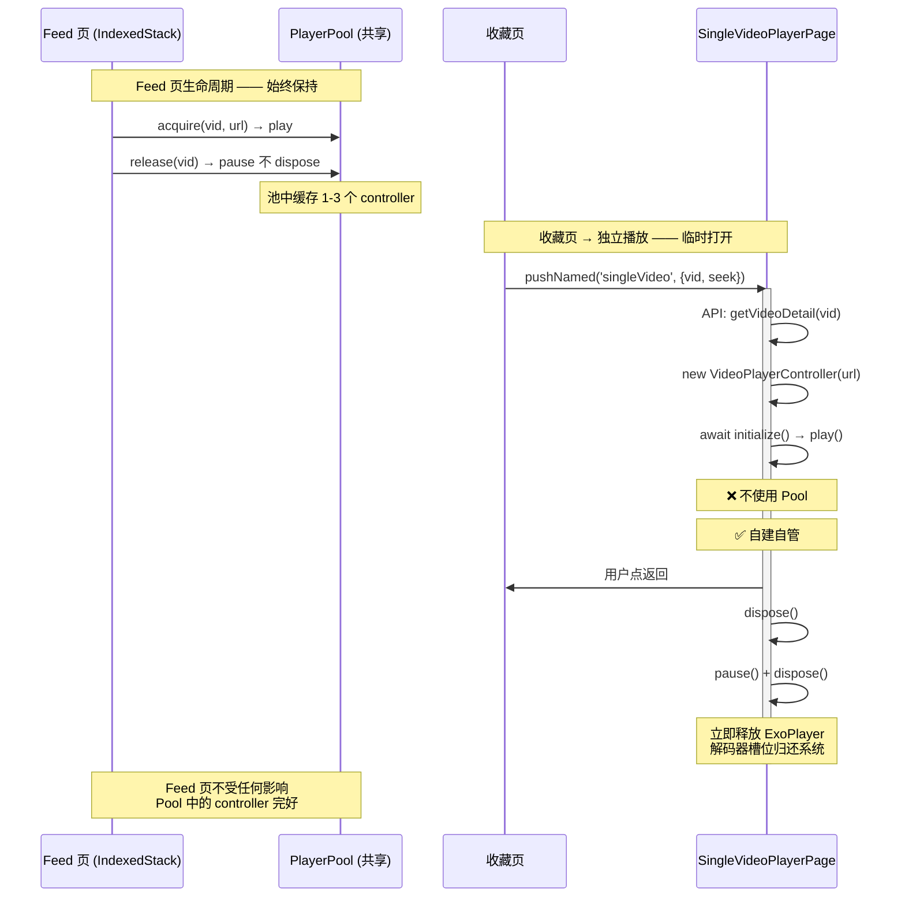

# 收藏页独立播放 — 与 Feed 页完全解耦架构

## 设计动机

收藏页点击视频需要播放，最初 5 版尝试复用 FeedPage 均失败（`loadVideos` 覆盖 / 死代码 / 竞态 / 资源竞争）。v6 最终方案：**完全独立的播放页，共享零状态**。

---

## 架构全景图

```mermaid
graph TB
    subgraph BOTTOM_NAV["底部导航栏 IndexedStack (始终存活)"]
        subgraph FEED["Feed 页 (tab 0)"]
            direction TB
            FP_UI["FeedPage UI<br/>PageView 滑动"]
            FP_STATE["FeedNotifier (FeedState)<br/>videos / currentIndex / hasMore / tab"]
            FP_POOL["PlayerPool (3 槽位)<br/>引用计数 + URL 去重"]
            FP_PRELOAD["VideoPreloadManager<br/>1 预加载 + WiFi 感知 + 1.5s 延迟"]

            FP_STATE --> FP_POOL
            FP_STATE --> FP_PRELOAD
            FP_PRELOAD --> FP_POOL
            FP_UI --> FP_POOL
        end
    end

    subgraph FAV["收藏页 (push 路由)"]
        direction TB
        FAV_UI["FavoritesPage<br/>视频 Tab 丨 商品 Tab"]
        FAV_API["ProductApi.getProductDetail()<br/>从服务器拉取最新商品数据"]
        FAV_UI --> FAV_API
    end

    subgraph SINGLE["独立播放页 (push 路由)"]
        direction TB
        SP_INIT["initState → _load()"]
        SP_API["VideoApi.getVideoDetail()<br/>timeout: 10s"]
        SP_CTRL["自建 VideoPlayerController<br/>.networkUrl(url)"]
        SP_INIT_V["await initialize()<br/>timeout: 20s"]
        SP_READY["_onReady()<br/>setLooping + play + seek"]
        SP_UI["自有 UI<br/>封面 → 视频 → 操作栏"]
        SP_DISPOSE["dispose()<br/>pause + dispose<br/>立即释放 ExoPlayer"]

        SP_INIT --> SP_API
        SP_API --> SP_CTRL
        SP_CTRL --> SP_INIT_V
        SP_INIT_V --> SP_READY
        SP_READY --> SP_UI
        SP_UI --> SP_DISPOSE
    end

    FAV_UI -->|"点击视频"| SP_INIT
    FAV_UI -->|"商品→跳转讲解"| SP_INIT

    FP_POOL -.->|"❌ 完全不共享<br/>各自独立管理"| SP_CTRL
    FP_STATE -.->|"❌ 不读不写"| SP_INIT
    FP_PRELOAD -.->|"❌ 不参与预加载"| SP_INIT

    style FEED fill:#1a2a1a,stroke:#4a4,color:#cfc
    style FAV fill:#1a1a2a,stroke:#48f,color:#ccf
    style SINGLE fill:#2a1a1a,stroke:#f66,color:#fcc
    style FP_POOL fill:#2a3a2a,stroke:#6c6
    style FP_PRELOAD fill:#2a3a2a,stroke:#6c6
    style SP_CTRL fill:#3a2a2a,stroke:#f88
    style SP_DISPOSE fill:#3a2a2a,stroke:#f88
```



---

## 生命周期对比



---

## 资源隔离对照表

```
┌─────────────────────────────────────────────────────────────┐
│                     资源隔离一览                              │
├──────────────┬──────────────────┬───────────────────────────┤
│    资源类型   │   Feed 页        │   SingleVideoPlayerPage   │
├──────────────┼──────────────────┼───────────────────────────┤
│ Controller   │ PlayerPool 管理   │ 自建，dispose 时销毁       │
│ 缓存         │ URL 去重，3 槽位  │ 无缓存，用完即弃           │
│ ExoPlayer    │ pause 保留解码器  │ dispose 释放解码器         │
│ 状态管理     │ FeedNotifier      │ widget 自身 State          │
│ 预加载       │ 1 个 + WiFi 感知  │ 不参与                     │
│ 数据来源     │ recommend/follow  │ getVideoDetail(id) 精准获取 │
│ 生命周期     │ IndexedStack 常驻 │ push 时创建，pop 时销毁     │
│ 与对方交互   │ 完全无感知        │ 完全无感知                 │
└──────────────┴──────────────────┴───────────────────────────┘
```

---

## 为什么必须隔离

```
v1-v5 复用 FeedPage 的失败路径:

  v1: 复用 FeedPage pendingJumpVideoId
      → loadVideos() 返回列表覆盖 pendingJumpVideoId ✗

  v2: insertVideoAtFront() 插到列表首位
      → loadVideos() 异步完成后整体替换列表 ✗

  v3: 死代码 bug
      → _pendingJumpVideoId = null 在 if 外面 ✗

  v4: 改用独立页，自建 controller
      → 每次 new VideoPlayerController → 从 GitHub 下载 ✗

  v5: 加 _urlCache 全局缓存
      → 与 Feed PlayerPool 抢 ExoPlayer ✗

  v6: ✅ 完全独立 + 防御式编程
      → 自建 controller → dispose 立即释放 → catch(e) 全捕获
```

---

## 一句话总结

> Feed 页是**常驻服务**（PlayerPool 缓存、预加载），独立播放页是**一次性工具**（打开→播放→释放），两者在 Controller、状态、缓存、预加载四个维度上**完全隔离**，通过不同的路由路径 (`/play/:id` vs `/video/:id`) 和独立的 Widget 树实现物理隔离。
