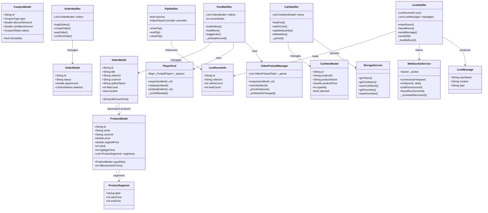
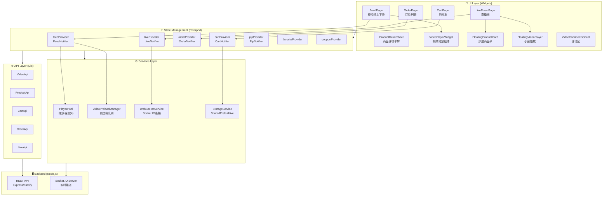
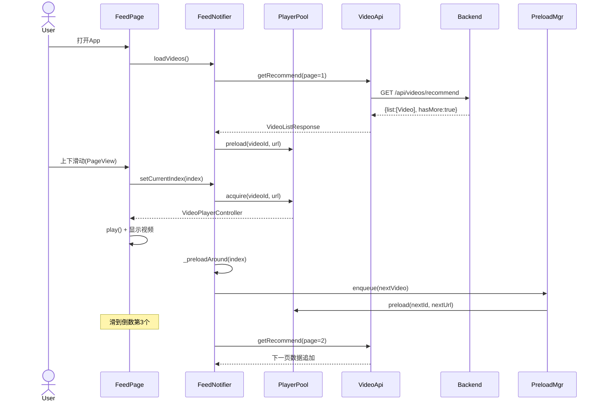
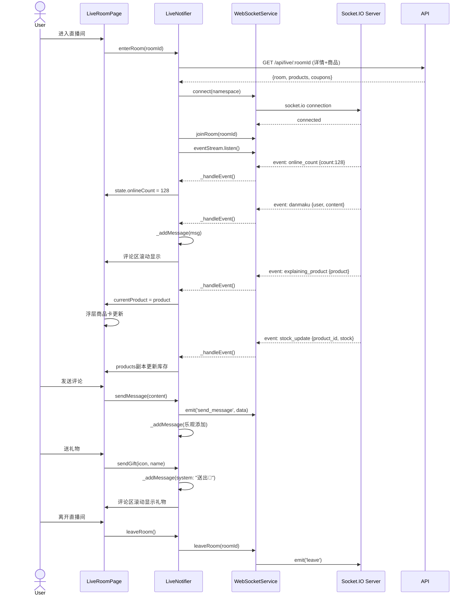
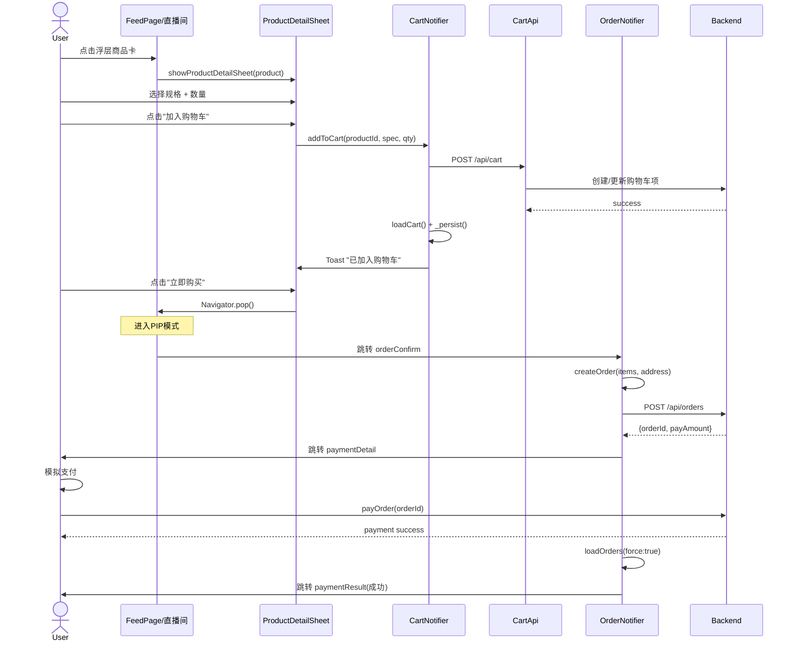
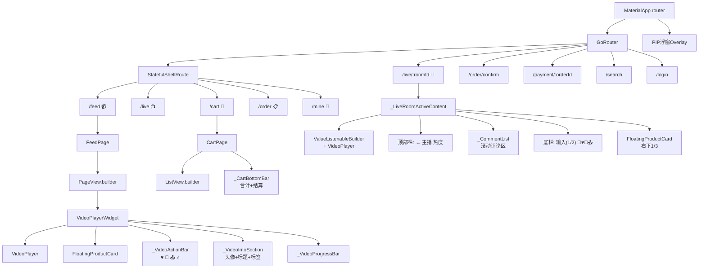
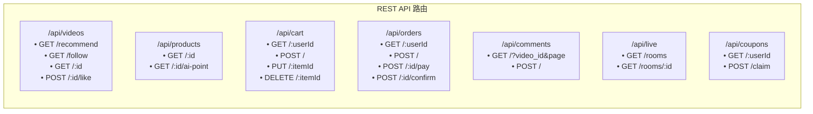

# 项目架构图（Mermaid）

> 涵盖：内容流浏览、RESTful API、实时通信、数据持久化

---

## 一、核心类图（Models + Providers + Services）



---

## 二、系统架构图（分层框架）



---

## 三、内容流浏览数据流（短视频Feed + 直播）



---

## 四、直播间实时通信数据流（WebSocket）



---

## 五、购物链路完整数据流



---

## 六、数据持久化架构

```mermaid
graph TB
    subgraph Client["📱 Client Storage"]
        direction TB
        SharedPrefs["SharedPreferences<br/>━━━━━━━━━━<br/>• auth_token<br/>• user_id<br/>• user_role"]
        HiveBox["Hive Box<br/>━━━━━━━━━━<br/>• favorites (JSON)<br/>• cart_items (JSON)<br/>• browsing_history (JSON)<br/>• user_profile (JSON)<br/>• coupons (JSON)"]
    end

    subgraph Server["🖥️ Server Storage"]
        MySQL["MySQL / PostgreSQL<br/>━━━━━━━━━━<br/>• users<br/>• videos<br/>• products<br/>• cart_items<br/>• orders<br/>• comments<br/>• coupons<br/>• live_rooms<br/>• gifts"]
    end

    subgraph Cache["⚡ Client Memory"]
        Riverpod["Riverpod State<br/>━━━━━━━━━━<br/>• FeedState (videos[])<br/>• CartState (items[])<br/>• OrderState (orders[])<br/>• LiveState (room+messages)<br/>• PipState (controller)<br/>• FavoriteState<br/>• AuthState"]
    end

    SharedPrefs --> Riverpod
    HiveBox --> Riverpod
    Riverpod --> MySQL : via REST API
    MySQL --> Riverpod : via REST API

    style Client fill:#1a1a2e,color:#fff
    style Server fill:#16213e,color:#fff
    style Cache fill:#0f3460,color:#fff
```

---

## 七、组件树（Widget Tree）



---

## 八、API路由总览



