# 模块详细设计 — Mermaid 流程图

---

## 7.1 FeedPage 滑动切换

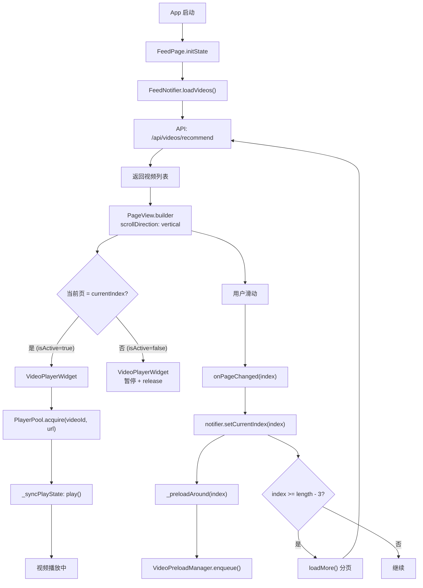

---

## 7.2 FeedNotifier 状态管理

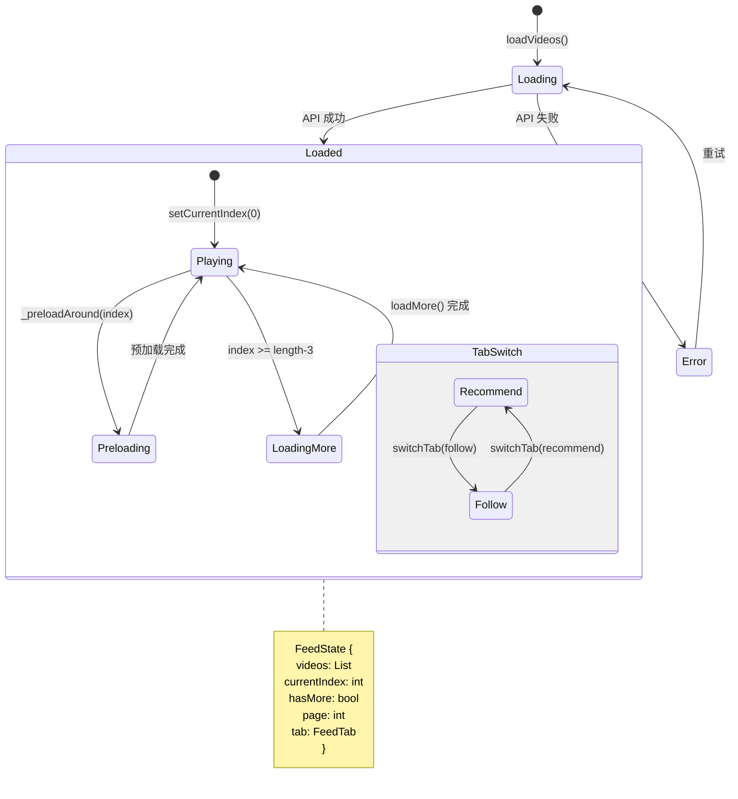

---

## 7.3 PlayerPool 播放器池

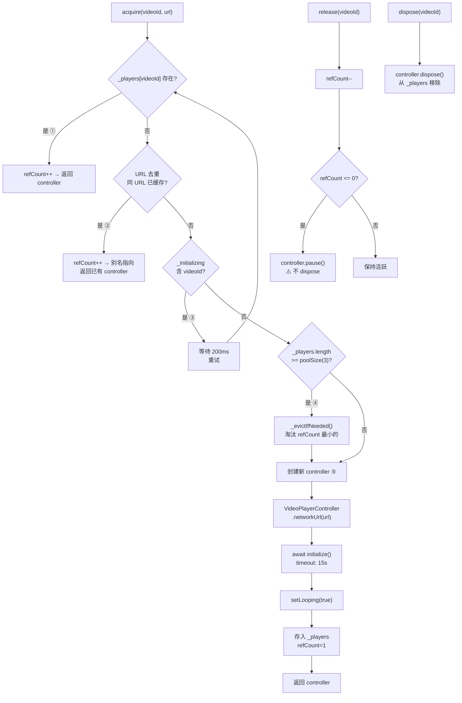

---

## 7.4 VideoPreloadManager 预加载

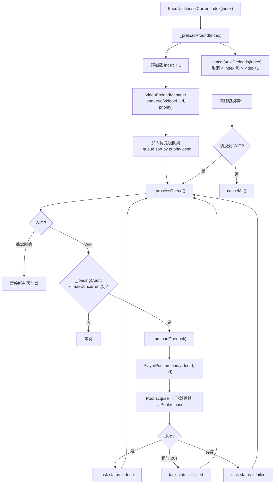

---

## 7.5 VideoPlayerWidget 视频播放器

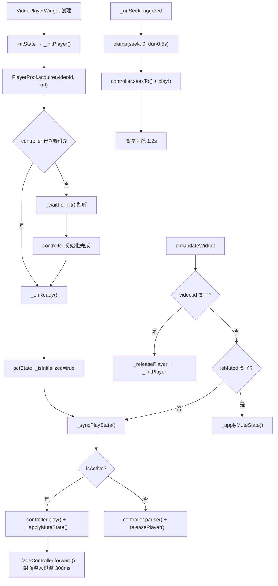

---

## 7.6 LiveRoomPage 直播间页面

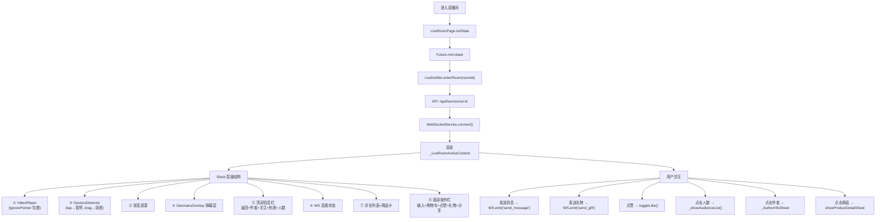

---

## 7.7 DanmakuOverlay 弹幕系统

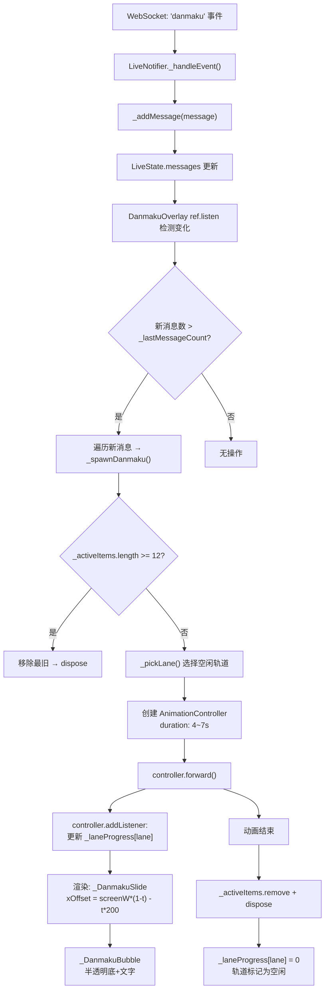

---

## 7.8 PiP 小窗播放

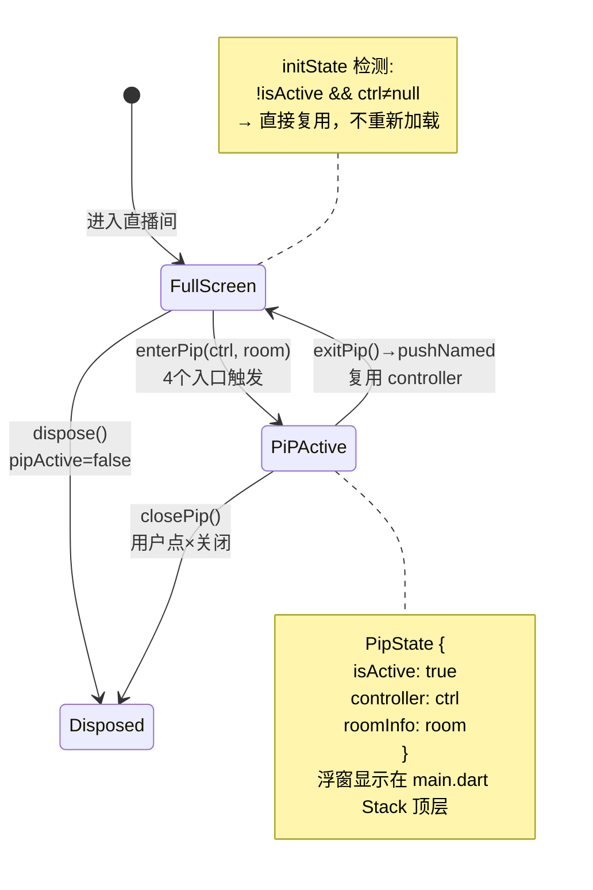

### PiP 进出时序

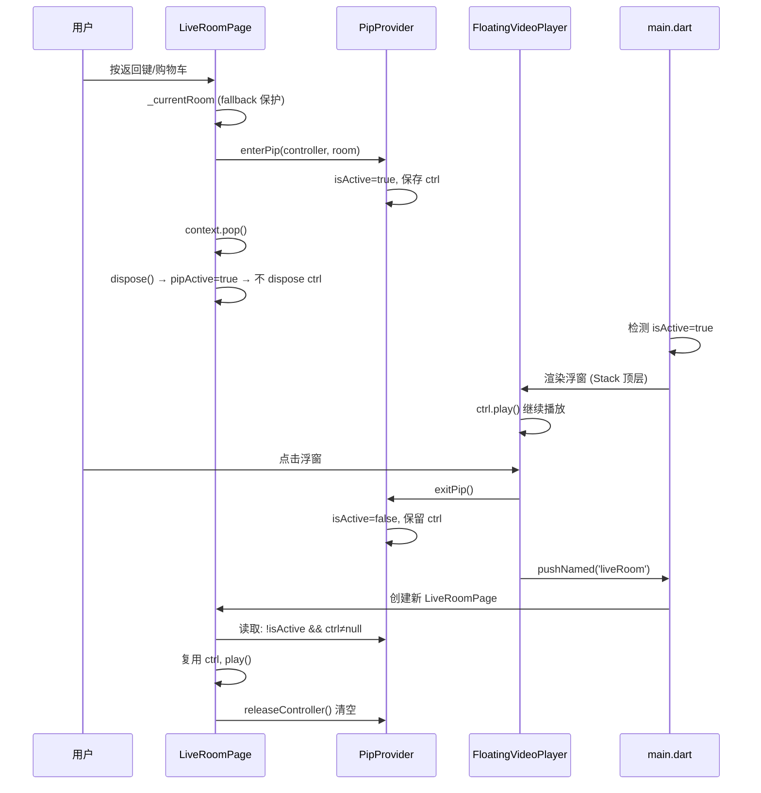

---

## 7.9 SingleVideoPlayerPage 收藏页独立播放

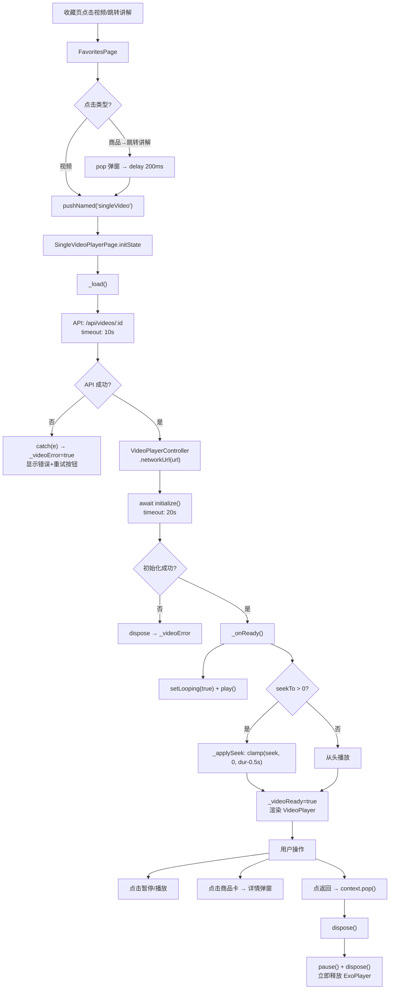

### 收藏页与 Feed 页解耦架构

```mermaid
graph TB
    subgraph Feed["Feed 页 (IndexedStack 常驻)"]
        FP["FeedPage"]
        FS["FeedState<br/>videos/currentIndex/hasMore"]
        PP["PlayerPool<br/>3 槽位 + URL 去重"]
        PM["VideoPreloadManager<br/>1 预加载 + WiFi 感知"]
    end

    subgraph Favorites["收藏页"]
        FV["FavoritesPage<br/>视频 Tab / 商品 Tab"]
    end

    subgraph Single["独立播放页 (push 路由)"]
        SP["SingleVideoPlayerPage"]
        SC["自建 VideoPlayerController"]
        SL["独立生命周期<br/>init → play → dispose"]
    end

    FV -->|"点击视频/跳转讲解"| SP
    SP -->|"dispose 立即释放"| SC

    FP --> FS
    FS --> PP
    FS --> PM
    PP -->|"完全不共享"| SC

    style SC fill:#f96,stroke:#333
    style SL fill:#f96,stroke:#333
    style PP fill:#6f9,stroke:#333
    style PM fill:#6f9,stroke:#333

    linkStyle 9 stroke:red,stroke-width:3px
```

---

## 整体模块交互总览

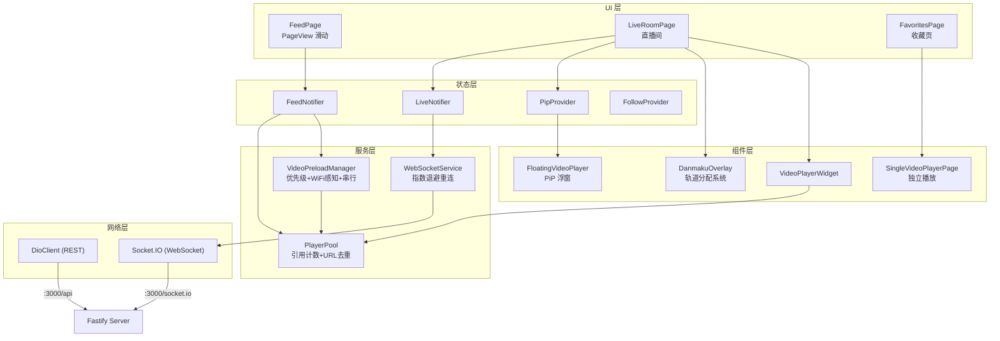

> **关键路径**：
> - **红色虚线**：Feed PlayerPool 与 SingleVideoPlayerPage **完全隔离**，互不干扰
> - **绿色实线**：PlayerPool 同时服务 FeedPage 和 VideoPreloadManager，共享缓存
> - **蓝色虚线**：PiP 状态通过 PipProvider 在 LiveRoomPage ↔ FloatingVideoPlayer 间传递
