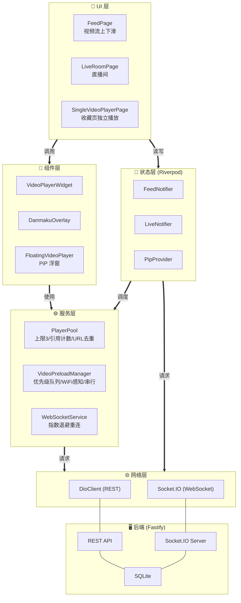
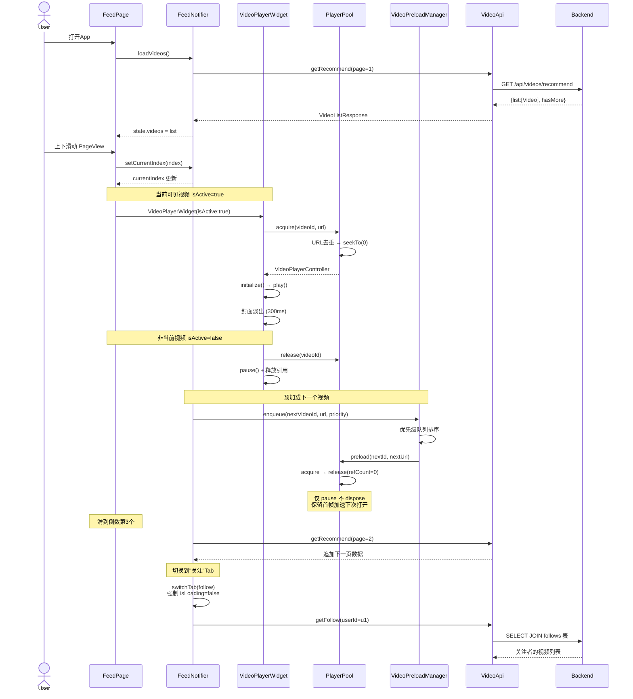
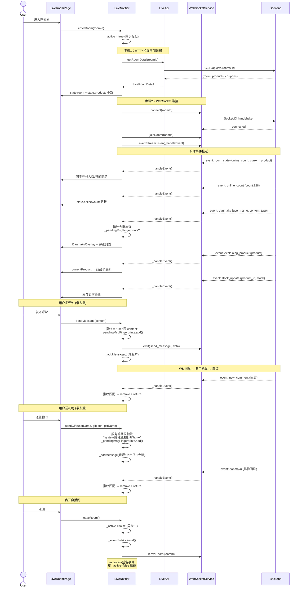
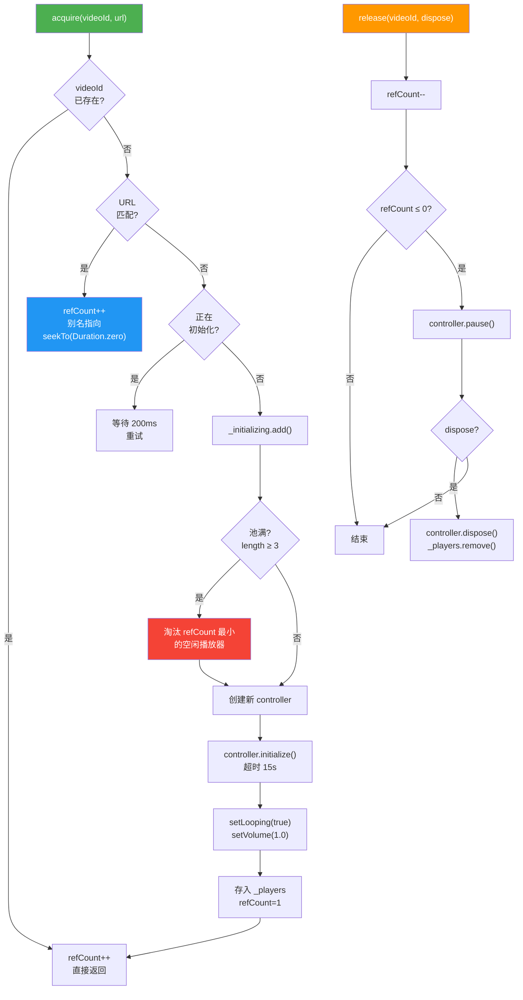
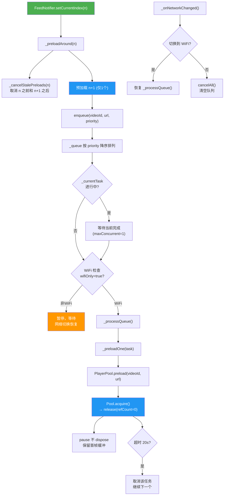
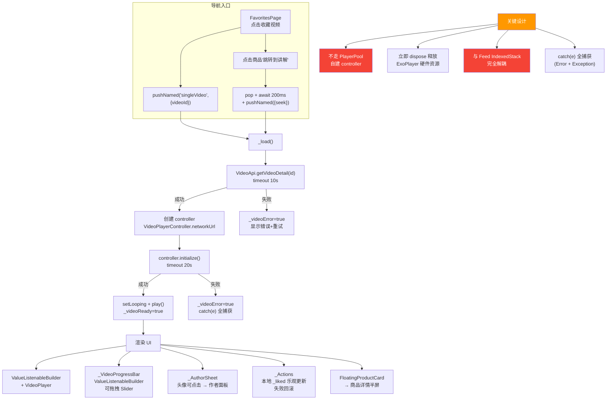
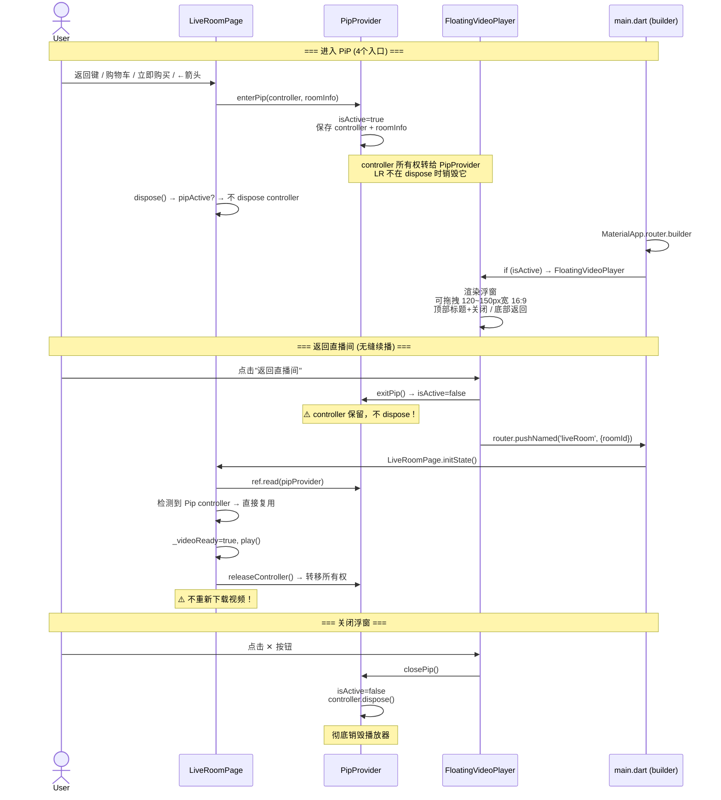
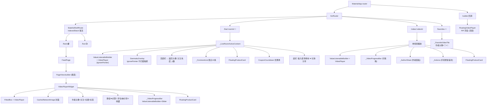
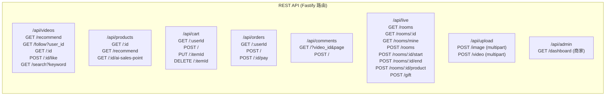

# 项目架构图（Mermaid）

> 涵盖 7 个核心模块：内容流浏览、直播间实时互动、播放器池、视频预加载、商品讲解片段定位、收藏页独立播放、小窗播放（PiP）

---

## ⚠️ 修正记录

| # | 位置 | 原错误 | 修正 |
|---|------|--------|------|
| 1 | 系统架构图 | `PlayerPool 播放器池(4)` | → `PlayerPool (上限3)`，池大小按实际代码为 3 |
| 2 | 内容流数据流 | `Notifier->>Pool: preload/acquire` | → FeedNotifier 不直接调 PlayerPool；acquire 由 VideoPlayerWidget 调用，preload 由 VideoPreloadManager 中转 |
| 3 | 直播间通信 | `API` 参与者未声明 | → `Notifier->>API` 行中 API 未在 participant 列表中声明，补充 `participant API as LiveApi` |
| 4 | 直播间通信 | 无消息去重流程 | → 补充 `sendMessage`/`sendGift` 的 `_pendingMsgFingerprints` 乐观添加 + 去重逻辑 |
| 5 | 直播间通信 | `sendGift(icon, name)` | → 实际为 3 个参数：`sendGift(userName, giftIcon, giftName)` |
| 6 | 数据持久化 | `MySQL / PostgreSQL` | → 实际为 **SQLite (better-sqlite3, WAL 模式)**，这是 Node.js 后端的实际数据库 |
| 7 | 组件树 | 缺 `DanmakuOverlay` | → LiveRoom 组件树补充弹幕层，PiP 补充 `MaterialApp.builder` 挂载方式 |

---

## 一、整体模块交互总览



> **说明**：粗箭头 `==>` 为层间依赖方向，细连线 `---` 为网络协议连接。不绘制层内组件的细粒度交叉连线，保持整体结构清晰。

---

## 二、内容流浏览（短视频Feed）



---

## 三、直播间实时互动（WebSocket + REST）



---

## 四、播放器池 (PlayerPool)



---

## 五、视频预加载 (VideoPreloadManager)



---

## 六、商品讲解片段定位

```mermaid
flowchart TB
    subgraph 数据模型
        PM["ProductModel<br/>highlightTime: int<br/>segments: List~ProductSegment~<br/>videoId: String"]
    end

    subgraph 路径A ["路径A: Feed页商品卡"]
        A1["用户点击 FloatingProductCard"] --> A2["showProductDetailSheet()"]
        A2 --> A3{"有讲解片段?"}
        A3 -->|0段+highlightTime| A4["单按钮<br/>跳转到讲解 (MM:SS)"]
        A3 -->|1段| A5["单按钮<br/>片段标签"]
        A3 -->|2+段| A6["按钮 → 片段选择弹窗"]
        A4 & A5 & A6 --> A7["onSeekToTime(time)"]
        A7 --> A8["_seekTrigger.value = time"]
        A8 --> A9["VideoPlayerWidget._onSeekTriggered()"]
        A9 --> A10["双重 clamp:<br/>clamp(0, durMs-500)"]
        A10 --> A11["controller.seekTo() + play()"]
        A11 --> A12["金色边框高亮 1.2s"]
    end

    subgraph 路径B ["路径B: 收藏页商品弹窗"]
        B1["FavoritesPage 点击商品"] --> B2["showProductDetailSheet()"]
        B2 --> B3["onSeekToTime(time)"]
        B3 --> B4["Navigator.pop() 关闭弹窗"]
        B4 --> B5["await 200ms<br/>(等退出动画完成)"]
        B5 --> B6["pushNamed('singleVideo',<br/>{seek: time})"]
        B6 --> B7["SingleVideoPlayerPage._applySeek()"]
        B7 --> B8["双重 clamp + seekTo"]
    end

    style A12 fill:#FFD700,color:#000
    style B5 fill:#FF9800,color:#fff
```



---

## 七、收藏页独立播放 (SingleVideoPlayerPage)



---

## 八、小窗播放 (PiP)



---

## 九、组件树（Widget Tree — 视频流+直播）



---

## 十、数据持久化架构

```mermaid
graph TB
    subgraph Client["📱 客户端存储"]
        direction TB
        SharedPrefs["SharedPreferences<br/>━━━━━━━━━━<br/>• auth_token<br/>• user_id<br/>• user_role"]
        HiveBox["Hive Box<br/>━━━━━━━━━━<br/>• favorites (JSON)<br/>• cart_items (JSON)<br/>• browsing_history (JSON)<br/>• user_profile (JSON)"]
    end

    subgraph Server["🖥️ 服务端存储"]
        SQLiteDB["SQLite (better-sqlite3)<br/>━━━━━━━━━━<br/>WAL 模式 / 15张表<br/>• users • videos • products<br/>• cart_items • orders<br/>• comments • coupons<br/>• live_rooms • live_messages<br/>• user_likes • follows<br/>• gift_records • gifts<br/>• recharge_records • refund_records<br/>• customer_service_messages"]
    end

    subgraph Cache["⚡ 客户端内存 (Riverpod)"]
        Riverpod["Riverpod State<br/>━━━━━━━━━━<br/>• FeedState (videos[])<br/>• LiveState (room+messages+_active)<br/>• CartState (items[])<br/>• OrderState (orders[])<br/>• PipState (controller+roomInfo)<br/>• FavoriteState (items[])<br/>• FollowState (followingIds Set)<br/>• AuthState (token+role)"]
    end

    SharedPrefs --> Riverpod
    HiveBox --> Riverpod
    Riverpod --> SQLiteDB : via Dio REST API
    SQLiteDB --> Riverpod : via Dio REST API

    style Client fill:#1a1a2e,color:#fff
    style Server fill:#16213e,color:#fff
    style Cache fill:#0f3460,color:#fff
```

---

## 十一、API路由总览


