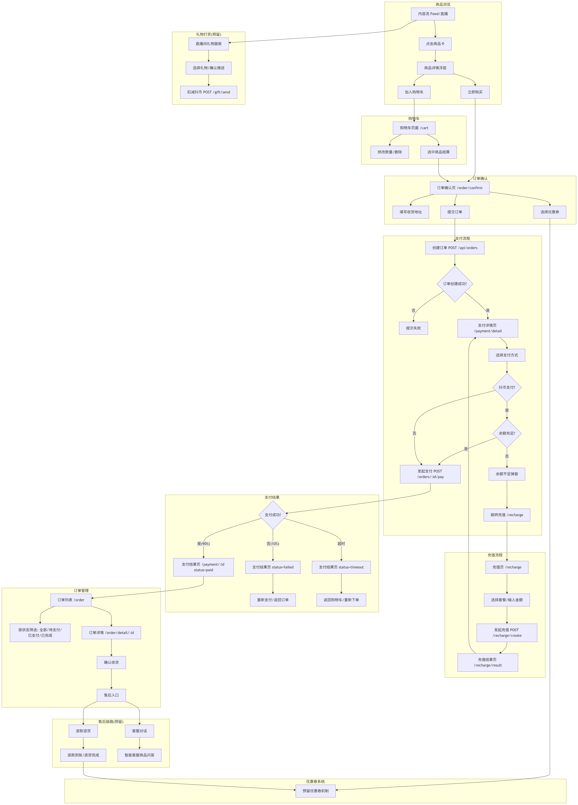
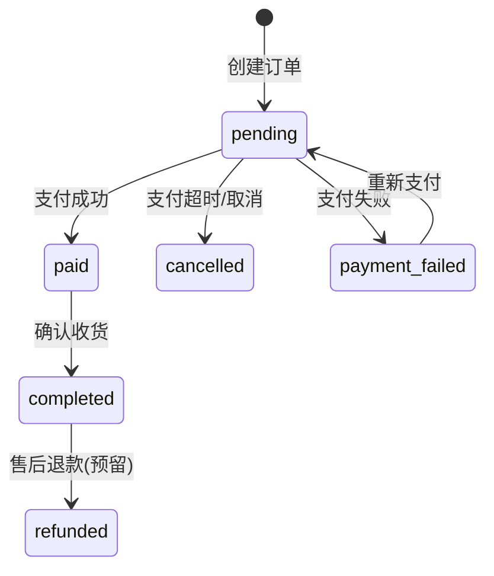

# 购物支付链路技术文档

## 1. 引言

### 1.1 项目背景

本项目是一个面向移动客户端的电商直播/短视频带货购物系统，基于 Flutter（移动端）+ Node.js + Fastify + SQLite（服务端）技术栈实现。项目的核心闭环为：

> **用户进入短视频/直播内容流 → 浏览商品讲解 → 点击商品卡 → 领取优惠或加购 → 提交订单 → 查看订单状态**

本文档聚焦于**购物支付链路**，即从用户将商品加入购物车开始，到最终完成支付查看订单的完整技术实现，涵盖移动端（Mobile）和服务端（Server）两端。

### 1.2 文档目的

- 梳理购物支付链路的完整数据流与代码实现
- 明确移动端和服务端各模块的职责、接口和交互方式
- 为后续开发维护（售后链路、礼物打赏等扩展）提供技术参考

### 1.3 适用范围

| 模块 | 说明 |
|------|------|
| 购物车 | 商品增删改查、数量修改、选中结算 |
| 订单 | 订单创建、订单列表、订单详情、确认收货 |
| 支付 | 模拟支付（微信/支付宝/抖币）、支付结果处理 |
| 充值 | 抖币充值套餐、自定义金额、充值到账 |
| 售后 | ❌ 尚未实现（本文档预留扩展点） |
| 礼物打赏 | ❌ 尚未实现（本文档预留扩展点） |

### 1.4 货币体系

```
人民币（元）──充值──> 抖币（虚拟资产，1:1）
                            ├── 购物支付（已实现）
                            └── 礼物打赏（预留接口）
```

- 充值比例：1 元人民币 = 1 抖币（充值会额外赠送）
- 抖币目前仅用于购物支付，已预留接口供后续礼物打赏扩展

---

## 2. 系统架构概览

### 2.1 整体架构

```
┌─────────────────────────────────────────────────┐
│                 Mobile 端 (Flutter)               │
│                                                   │
│  Page Layer         Provider Layer    API Layer   │
│  ┌───────────┐     ┌────────────┐   ┌────────┐   │
│  │CartPage    │────▶│CartProvider│──▶│CartApi │   │
│  │OrderConfirm│────▶│OrderNotif. │──▶│OrderApi│   │
│  │PaymentDtl  │     │UserNotifier│   │RchgApi │   │
│  │PaymentRslt │     └────────────┘   └───┬────┘   │
│  │CoinRecharge│                          │HTTP     │
│  │RchgResult  │                          │         │
│  └───────────┘                           │         │
└──────────────────────────────────────────┼─────────┘
                                           │
                              RESTful API  │
                                           ▼
┌──────────────────────────────────────────────────┐
│               Server 端 (Node.js + Fastify)        │
│                                                    │
│  Routes Layer            Database Layer           │
│  ┌──────────────┐      ┌────────────────────┐    │
│  │orders.ts     │─────▶│                    │    │
│  │recharge.ts   │─────▶│  SQLite (SQLite3)  │    │
│  │users.ts      │─────▶│  commerce.db       │    │
│  │cart.ts       │─────▶│                    │    │
│  └──────────────┘      └────────────────────┘    │
└──────────────────────────────────────────────────┘
```

### 2.2 技术栈

| 层级 | 技术 | 说明 |
|------|------|------|
| 移动端 UI | Flutter + Dart | 页面组件与交互 |
| 状态管理 | Riverpod | Provider 模式管理全局状态 |
| 路由 | go_router | 声明式路由管理 |
| 网络请求 | Dio | HTTP 客户端，封装请求拦截 |
| 服务端框架 | Fastify (Node.js) | 高性能路由框架 |
| 数据库 | better-sqlite3 | 轻量级嵌入式数据库 |
| 实时通信 | WebSocket (Socket.IO) | 直播间实时消息 |

---

## 3. 购物支付全流程图



---

## 4. 数据模型

### 4.1 订单表（orders）

| 字段 | 类型 | 说明 | 示例 |
|------|------|------|------|
| id | TEXT PK | 订单 ID（UUID） | 7a1b2c3d-... |
| user_id | TEXT FK | 用户 ID | u1 |
| total_amount | REAL | 商品总额 | 627.00 |
| discount_amount | REAL | 优惠金额 | 20.00 |
| pay_amount | REAL | 实付金额 | 607.00 |
| status | TEXT | 订单状态（见下方状态机） | pending |
| address | TEXT(JSON) | 收货地址 JSON | {"name":"张三",...} |
| items | TEXT(JSON) | 商品列表 JSON | [{"product_id":...}] |
| created_at | TEXT | 创建时间 | 2026-05-28 10:00:00 |
| updated_at | TEXT | 更新时间 | 2026-05-28 10:05:00 |

**订单状态机：**



**状态枚举：**

| 值 | 含义 | 前端状态文本 |
|----|------|-------------|
| pending | 待支付 | 待支付 |
| paid | 已支付 | 已支付 |
| shipped | 已发货 | 已发货（预留） |
| completed | 已完成 | 已完成 |
| cancelled | 已取消 | 已取消 |
| payment_failed | 支付失败 | 支付失败 |
| refunding | 退款中（预留） | 退款中 |
| refunded | 已退款（预留） | 已退款 |

### 4.2 充值记录表（recharge_records）

| 字段 | 类型 | 说明 | 示例 |
|------|------|------|------|
| id | TEXT PK | 充值单号 | R2026052810... |
| user_id | TEXT FK | 用户 ID | u1 |
| amount | REAL | 充值金额（元） | 98.00 |
| bonus_amount | REAL | 赠送金额 | 5.00 |
| total_coins | REAL | 到账总抖币 | 103.00 |
| payment_method | TEXT | 支付方式 | wechat/alipay |
| status | TEXT | 充值状态 | success |
| created_at | TEXT | 创建时间 | 2026-05-28 10:00:00 |

**充值状态：**

- `success` - 充值成功（当前模拟支付直接成功）
- `pending` - 待处理（预留）
- `failed` - 充值失败（预留）

### 4.3 用户抖币字段（users）

| 字段 | 类型 | 说明 | 默认值 |
|------|------|------|--------|
| coin_balance | REAL | 抖币余额 | 0 |

### 4.4 核心 ER 关系

```
users (1) ──── (N) orders
users (1) ──── (N) recharge_records
users (1) ──── (N) cart_items
cart_items (N) ──── (1) products
orders.items ──▶ JSON 存储商品快照（非外键）
```

> **注意**：订单的 `items` 字段以 JSON 字符串存储商品快照，包括创建订单时商品的名称、价格、数量等。这样即使后续商品信息发生变化，订单历史记录依然保持准确。

---

## 5. 服务端（Server）实现详解

### 5.1 项目结构（购物支付相关）

```
apps/server/src/
├── index.ts                 # 入口文件，注册所有路由
├── db/
│   ├── schema.ts            # 数据库表结构定义与初始化
│   └── seed.ts              # 测试数据填充
├── middleware/
│   └── auth.ts              # 用户认证中间件
├── routes/
│   ├── orders.ts            # 订单相关 API（创建/查询/支付/确认收货）
│   ├── recharge.ts          # 充值相关 API（创建充值/查询记录/查余额）
│   ├── cart.ts              # 购物车 API
│   └── users.ts             # 用户 API（含抖币余额等）
```

### 5.2 订单路由（routes/orders.ts）

#### 5.2.1 创建订单 `POST /api/orders`

**请求参数：**

```json
{
  "user_id": "u1",
  "items": [
    {
      "product_id": "xxx",
      "spec": "黑色",
      "quantity": 1,
      "cart_item_id": "yyy"
    }
  ],
  "address": { "name": "张三", "phone": "13800000001", "detail": "北京市..." },
  "coupon_id": "zzz"
}
```

**业务逻辑：**

1. 校验商品是否存在且已上架（`status = 'on'`）
2. 校验库存是否充足
3. 计算商品总额（累加各商品 `price * quantity`）
4. 应用优惠券（校验门槛、扣减优惠金额）
5. 扣减商品库存（`stock - quantity`，`sales + quantity`）
6. 生成订单 ID（UUID），设置状态为 `pending`
7. 从购物车中删除已下单的商品（如有 `cart_item_id`）
8. 返回创建结果

**响应示例：**

```json
{
  "code": 0,
  "data": {
    "id": "7a1b2c3d-...",
    "total_amount": 627.00,
    "discount_amount": 0,
    "pay_amount": 627.00,
    "status": "pending",
    "items": [...]
  }
}
```

#### 5.2.2 订单列表 `GET /api/orders/:user_id`

| 查询参数 | 类型 | 必填 | 说明 |
|---------|------|------|------|
| status | string | 否 | 按状态筛选 |
| page | number | 否 | 页码（默认1） |
| page_size | number | 否 | 每页数量（默认10，最大50） |

**分页响应：**

```json
{
  "code": 0,
  "data": {
    "list": [...],
    "total": 42,
    "page": 1,
    "page_size": 10,
    "has_more": true
  }
}
```

#### 5.2.3 订单详情 `GET /api/orders/detail/:id`

返回单个订单的完整信息，包括解析后的 `items` 和 `address` JSON。

#### 5.2.4 模拟支付 `POST /api/orders/:id/pay`

**请求参数：**

```json
{
  "payment_method": "coin" | "wechat" | "alipay"
}
```

**业务逻辑：**

1. 校验订单是否存在且状态为 `pending`
2. **抖币支付**时：
   - 查询用户抖币余额（`coin_balance`）
   - 检查余额是否足够支付（`balance >= pay_amount`）
   - 扣减余额（`coin_balance = coin_balance - pay_amount`）
3. 模拟支付结果：90% 概率成功，10% 概率失败
4. 更新订单状态为 `paid` 或 `payment_failed`
5. **支付失败且为抖币支付**时：退还扣减的余额
6. 返回支付结果和新余额

```typescript
// 核心代码摘要
const success = Math.random() > 0.1;
const status = success ? 'paid' : 'payment_failed';

db.prepare('UPDATE orders SET status = ?, updated_at = datetime(\'now\') WHERE id = ?')
  .run(status, req.params.id);

// 抖币支付失败时退还
if (!success && paymentMethod === 'coin') {
  db.prepare('UPDATE users SET coin_balance = coin_balance + ? WHERE id = ?')
    .run(payAmount, order.user_id);
}
```

#### 5.2.5 确认收货 `POST /api/orders/:id/confirm`

- 仅 `paid` 状态可确认收货
- 更新状态为 `completed`

### 5.3 充值路由（routes/recharge.ts）

#### 5.3.1 创建充值 `POST /api/recharge/create`

**请求参数：**

```json
{
  "user_id": "u1",
  "amount": 98,
  "payment_method": "wechat" | "alipay"
}
```

**充值赠送规则：**

| 充值金额（元） | 赠送抖币 | 赠送比例 |
|---------------|---------|---------|
| 6 | 0 | 0% |
| 30 | 1 | 3.3% |
| 98 | 5 | 5.1% |
| ✨ 198 | 15 | 7.6% |
| 328 | 28 | 8.5% |
| ✨ 648 | 65 | 10% |
| 自定义金额 | 5%（向下取整） | — |

**业务逻辑：**

1. 校验参数合法性（金额 > 0，支付方式支持 wechat/alipay）
2. 根据充值金额计算赠送抖币（匹配预置套餐或自定义规则）
3. 创建充值记录（状态直接设为 `success`，模拟到账）
4. 更新用户抖币余额（`coin_balance = coin_balance + total_coins`）
5. 返回充值结果

```typescript
// 核心代码摘要
const bonusAmount = getBonus(amount);      // 计算赠送
const totalCoins = amount + bonusAmount;    // 总到账
// 插入充值记录
db.prepare('INSERT INTO recharge_records ...').run(orderId, user_id, amount, bonusAmount, totalCoins, payment_method);
// 更新余额
db.prepare('UPDATE users SET coin_balance = coin_balance + ? WHERE id = ?').run(totalCoins, user_id);
```

#### 5.3.2 查询充值记录 `GET /api/recharge/records/:userId`

返回该用户最近 50 条充值记录。

#### 5.3.3 查询抖币余额 `GET /api/users/:id/coins`

```json
{
  "code": 0,
  "data": { "coin_balance": 356.0 }
}
```

### 5.4 数据初始化（db/seed.ts）

种子数据包含购物支付测试所需数据：

| 数据 | 数量 | 说明 |
|------|------|------|
| 用户 | 5 个 | 含 1 个测试用户（u1） |
| 商品 | 20 个 | 覆盖数码、服饰、美妆、户外等品类 |
| 购物车商品 | 3 条 | 测试用户 u1 的购物车数据 |
| 订单 | 2 条 | 1 条已支付 + 1 条待支付 |
| 优惠券 | 2 张 | 新人满100减20、直播间满200减50 |

---

## 6. 移动端（Mobile）实现详解

### 6.1 项目结构（购物支付相关）

```
apps/mobile/lib/
├── api/
│   ├── cart_api.dart         # 购物车 API 封装
│   ├── order_api.dart        # 订单 API 封装
│   └── recharge_api.dart     # 充值 API 封装
├── models/
│   ├── cart_model.dart        # 购物车数据模型
│   └── order_model.dart       # 订单/地址/商品项模型
├── provider/
│   ├── cart_provider.dart     # 购物车状态管理
│   ├── order_provider.dart    # 订单状态管理
│   ├── user_provider.dart     # 用户状态（含抖币余额）
│   └── service_providers.dart # Provider 统一注册
├── pages/
│   ├── cart/
│   │   └── cart_page.dart     # 购物车页面
│   ├── order/
│   │   ├── order_confirm_page.dart   # 订单确认页
│   │   ├── payment_detail_page.dart  # 支付详情页
│   │   ├── payment_result_page.dart  # 支付结果页
│   │   ├── order_page.dart           # 订单列表页
│   │   └── order_detail_page.dart    # 订单详情页
│   └── recharge/
│       ├── coin_recharge_page.dart   # 抖币充值页
│       └── recharge_result_page.dart # 充值结果页
└── core/
    ├── app_router.dart        # 路由配置
    └── app_constants.dart     # 全局常量（API 地址等）
```

### 6.2 页面导航与路由

使用 `go_router` 管理路由，购物支付核心路由：

| 路由名称 | 路径 | 页面组件 | 说明 |
|---------|------|---------|------|
| cart | `/cart` | CartPage | 购物车（底部 Tab） |
| orderConfirm | `/order/confirm` | OrderConfirmPage | 订单确认 |
| paymentDetail | `/payment/detail/:orderId` | PaymentDetailPage | 支付详情/选择支付方式 |
| paymentResult | `/payment/:orderId` | PaymentResultPage | 支付结果展示 |
| order | `/order` | OrderPage | 订单列表（底部 Tab） |
| orderDetail | `/order/detail/:orderId` | OrderDetailPage | 订单详情 |
| coinRecharge | `/recharge` | CoinRechargePage | 抖币充值 |
| rechargeResult | `/recharge/result` | RechargeResultPage | 充值结果 |

### 6.3 购物车模块

#### 页面：CartPage

**关键特性：**

- 商品列表展示：封面图、名称、规格、单价、数量
- 每项可独立选中/取消选中（圆形复选框）
- 全选/取消全选（顶部按钮）
- 数量加减（圆形加减按钮，触底防溢出）
- 左滑删除（`Dismissible` 组件）
- 底部结算栏：合计金额、结算按钮（仅选中项 > 0 可点击）
- 空购物车时展示"购物车是空的"和"去逛逛"按钮
- 底部附加"猜你喜欢"推荐商品列表

**数据流：**

```
CartPage ──watch──▶ cartProvider ──▶ cartApi ──HTTP──▶ Server /api/cart/*
                    │
                    └── 选中商品 → pushNamed('/order/confirm')
```

#### Provider：CartNotifier (cart_provider.dart)

| 方法 | 功能 |
|------|------|
| `loadCart()` | 加载购物车列表 |
| `addToCart()` | 添加商品到购物车 |
| `updateQuantity()` | 修改商品数量（乐观更新） |
| `toggleSelect()` | 切换选中状态 |
| `toggleSelectAll()` | 全选/取消全选 |
| `deleteItem()` | 删除购物车项（乐观更新） |

**计算属性：**

| 属性 | 类型 | 说明 |
|------|------|------|
| `allSelected` | bool | 是否全部选中 |
| `selectedCount` | int | 选中商品数量 |
| `totalAmount` | double | 选中商品总价 |
| `selectedItems` | List | 选中的购物车项列表 |

### 6.4 订单确认模块

#### 页面：OrderConfirmPage

**页面结构：**

1. **收货地址**：收货人、手机号、详细地址（可编辑输入框）
2. **商品信息**：从购物车选中的商品列表（封面、名称、规格、单价、数量）
3. **费用明细**：商品总额、优惠金额、实付金额
4. **提交按钮**：底部固定栏，显示"提交订单 ¥xxx"

**提交订单流程：**

```
用户点击"提交订单"
  → orderNotifier.createOrder(items, address, couponId)
    → orderApi.createOrder()
      → POST /api/orders
        → 服务端校验库存、计算金额、扣减库存、清理购物车
      ← 返回 orderId、payAmount
    ← 返回 CreateOrderResult
  → pushReplacementNamed('paymentDetail', params: {orderId, amount})
```

### 6.5 支付详情模块

#### 页面：PaymentDetailPage

**页面结构：**

1. **倒计时**：180 秒内完成支付（最后 30 秒变红色警告）
2. **实付金额**：大字体显示 ¥xxx.xx
3. **订单信息**：订单编号、下单时间
4. **商品信息**：订单中包含的商品列表
5. **支付方式选择**：
   - **抖币支付**（优先推荐，显示当前余额）
   - 微信支付
   - 支付宝
6. **确认支付按钮**

**抖币不足处理：**

```
用户选择"抖币支付"且余额不足
  → 弹出余额不足对话框
    → 显示当前余额和差值
    → "去充值"按钮
      → pushNamed('coinRecharge', params: {from: 'payment', order_id, amount})
```

**支付超时处理：**

当倒计时归零且未支付时，自动跳转到支付结果页（status=timeout）。

### 6.6 支付结果模块

#### 页面：PaymentResultPage

**三种结果状态：**

| 状态 | 图标 | 描述 | 操作按钮 |
|------|------|------|---------|
| paid | ✅ 绿色 | 支付成功，订单已提交 | 查看订单 |
| failed | ❌ 红色 | 支付失败，可重试 | 重新支付、查看订单 |
| timeout | ⏰ 红色 | 支付超时，订单自动取消 | 返回购物车、查看订单 |

支付成功时，页面底部还会展示"猜你喜欢"商品推荐。

### 6.7 订单列表模块

#### 页面：OrderPage

**Tab 筛选：**

| Tab | 状态筛选 | 说明 |
|-----|---------|------|
| 全部 | 不筛选 | 显示所有订单 |
| 待支付 | pending | 显示可支付的订单 |
| 已支付 | paid | 显示已支付未收货的订单 |
| 已完成 | completed | 显示确认收货的订单 |

**订单卡片操作：**

| 订单状态 | 可用操作 |
|---------|---------|
| pending（待支付） | 去支付 → 跳转支付详情页 |
| paid（已支付） | 确认收货（弹出确认对话框） |
| completed（已完成） | 售后入口（预留，当前提示"客服功能开发中"） |

### 6.8 抖币充值模块

#### 页面：CoinRechargePage

**页面结构：**

1. **金色渐变横幅**："充得越多 · 送得越多"
2. **赠送比例阶梯条**：可视化展示各档位赠送比例
3. **套餐卡片（2行×3列）**：

| 价格 | 到账 | 赠送 | 标签 |
|------|------|------|------|
| ¥6 | 6 币 | 0 | — |
| ¥30 | 31 币 | 1 | — |
| ¥98 | 103 币 | 5 | 🔥 最受欢迎 |
| ¥198 | 213 币 | 15 | 💎 最划算 |
| ¥328 | 356 币 | 28 | — |
| ¥648 | 713 币 | 65 | — |

4. **自定义金额**：折叠式输入框，自定义金额无赠送
5. **支付方式**：微信支付 / 支付宝
6. **底部确认按钮**：显示金额和赠送信息

**充值流程（从支付页跳转）：**

```
支付页(余额不足) → 充值页 /recharge?from=payment&order_id=xxx&amount=yyy
  → 选择套餐/输入金额
  → 确认充值
    → rechargeApi.createRecharge(userId, amount, paymentMethod)
      → POST /api/recharge/create (服务端计算赠送、到账)
    ← 返回 new_balance、bonus_amount 等
  → updateCoinBalance(new_balance)  // 刷新本地余额
  → pushReplacementNamed('rechargeResult', params: {from: 'payment', order_id, ...})
    → "返回支付页面" 按钮 → pushReplacementNamed('paymentDetail')
```

### 6.9 充值结果模块

#### 页面：RechargeResultPage

**页面结构：**

1. 绿色对勾图标 + "充值成功"
2. 到账总额（大号金色字体 + 抖动图标）
3. 充值明细：充值金额、额外赠送、当前余额
4. 底部按钮：
   - 从支付页过来的：返回支付页面
   - 从个人中心过来的：返回个人中心

---

## 7. API 接口汇总

### 7.1 订单接口

| 方法 | 路径 | 功能 | 请求体 |
|------|------|------|--------|
| POST | `/api/orders` | 创建订单 | `{user_id, items[], address?, coupon_id?}` |
| GET | `/api/orders/:user_id` | 订单列表 | query: `status?, page?, page_size?` |
| GET | `/api/orders/detail/:id` | 订单详情 | — |
| POST | `/api/orders/:id/pay` | 模拟支付 | `{payment_method?}` |
| POST | `/api/orders/:id/confirm` | 确认收货 | — |

### 7.2 充值接口

| 方法 | 路径 | 功能 | 请求体 |
|------|------|------|--------|
| POST | `/api/recharge/create` | 创建充值 | `{user_id, amount, payment_method}` |
| GET | `/api/recharge/records/:userId` | 充值记录 | — |
| GET | `/api/users/:id/coins` | 查抖币余额 | — |

### 7.3 购物车接口

| 方法 | 路径 | 功能 | 请求体 |
|------|------|------|--------|
| GET | `/api/cart/:user_id` | 获取购物车 | — |
| POST | `/api/cart` | 添加商品 | `{user_id, product_id, spec?, quantity?}` |
| PUT | `/api/cart/:item_id` | 修改项 | `{quantity?, selected?}` |
| DELETE | `/api/cart/:item_id` | 删除项 | — |

---

## 8. 核心业务流程详解

### 8.1 下单支付完整时序

```
用户              Flutter App                    Server
 │                    │                            │
 │ 点击"提交订单"      │                            │
 │──────────────────▶│                            │
 │                    │  POST /api/orders          │
 │                    │───────────────────────────▶│
 │                    │                            │── 校验商品、库存
 │                    │                            │── 计算金额、扣库存
 │                    │                            │── 清理购物车
 │                    │◀───────────────────────────│
 │                    │  {code:0, data: {id, ...}} │
 │                    │                            │
 │ 跳转支付详情页     │                            │
 │◀──────────────────│                            │
 │                    │                            │
 │ 选择"抖币支付"     │                            │
 │──────────────────▶│                            │
 │                    │  POST /orders/:id/pay      │
 │                    │  {payment_method: "coin"}  │
 │                    │───────────────────────────▶│
 │                    │                            │── 校验订单状态
 │                    │                            │── 校验余额
 │                    │                            │── 扣减余额
 │                    │                            │── 模拟支付结果
 │                    │◀───────────────────────────│
 │                    │  {data: {status:"paid",    │
 │                    │   new_balance:xxx}}        │
 │                    │                            │
 │ 跳转支付结果页     │                            │
 │◀──────────────────│                            │
```

### 8.2 充值后返回支付时序

```
支付详情页                  充值页面                  服务端
    │                        │                        │
    │  余额不足，跳转充值     │                        │
    │── pushRecharge ──────▶│                        │
    │   (from=payment,      │                        │
    │    order_id, amount)  │                        │
    │                        │  POST /recharge/create │
    │                        │───────────────────────▶│
    │                        │                        │── 计算赠送
    │                        │                        │── 到账(模拟)
    │                        │◀───────────────────────│
    │                        │  {data: {new_balance,  │
    │                        │   bonus_amount,...}}   │
    │                        │                        │
    │                        │── 更新本地余额         │
    │                        │── 跳转充值结果页       │
    │                        │                        │
    │  ←── "返回支付页面" ───│                        │
    │  pushReplacement       │                        │
    │  paymentDetail         │                        │
    │                        │                        │
    │  POST /orders/:id/pay  │                        │
    │────────────────────────────────────────────────▶│
    │  {payment_method:"coin"}│                        │
    │                        │                        │
```

### 8.3 抖币支付余额校验逻辑

```dart
// payment_detail_page.dart - 核心校验逻辑
Future<void> _doPay() async {
  // 抖币支付检查
  if (_selectedPayment == 'coin') {
    final userState = ref.read(userProvider);
    if (userState.coinBalance < widget.amount) {
      _showInsufficientBalanceDialog();  // 弹出充值引导
      return;
    }
  }

  // 发起支付
  final success = await ref.read(orderProvider.notifier).payOrder(
    widget.orderId,
    paymentMethod: _selectedPayment,
  );
  // 根据结果跳转...
}
```

### 8.4 订单状态管理

```dart
// order_provider.dart - 核心方法
final class OrderNotifier extends StateNotifier<OrderState> {
  // 加载订单列表（支持分页）
  Future<void> loadOrders({String? status}) async { ... }
  Future<void> loadMore() async { ... }

  // 创建订单
  Future<CreateOrderResult?> createOrder({items, address, couponId}) async { ... }

  // 支付订单
  Future<bool> payOrder(String orderId, {String paymentMethod = 'wechat'}) async { ... }

  // 确认收货
  Future<bool> confirmOrder(String orderId) async { ... }
}
```

---

## 9. 异常与边界处理

### 9.1 网络异常

| 场景 | 前端处理 | 代码位置 |
|------|---------|---------|
| 购物车加载失败 | `showToast('xxx')` | cart_provider.dart |
| 创建订单失败 | `showToast('下单失败，请重试')` | order_provider.dart |
| 支付失败 | 支付结果页显示失败状态，提供重试 | payment_result_page.dart |
| 充值失败 | `showToast('充值失败，请重试')` | coin_recharge_page.dart |

### 9.2 业务异常

| 场景 | 异常处理 | 服务端状态码 |
|------|---------|-------------|
| 商品不存在或已下架 | 返回 404 + 提示信息 | `code: 404` |
| 库存不足 | 返回 422 + 提示具体商品 | `code: 422` |
| 订单状态不允许支付（非 pending） | 返回 422 + 提示 | `code: 422` |
| 抖币余额不足 | 返回 422 + 返回当前余额和所需金额 | `code: 422, data: {balance, need}` |
| 订单不存在 | 返回 404 | `code: 404` |

### 9.3 金额校验

- **前端校验**：购物车总价由 `CartState.totalAmount` 计算得出，提交订单时传至服务端
- **后端校验**：服务端重新计算商品总额、优惠金额和实付金额，不信任前端传入金额

### 9.4 订单超时

- 前端：支付详情页启动 180 秒倒计时，归零后自动跳转支付结果页（timeout）
- 后端：当前未实现服务端自动取消超时订单，**需后续完善**

### 9.5 支付幂等性

- 支付接口不做幂等性校验（当前模拟支付）
- **建议**：后续接入真实支付时，需增加 `payment_id` 唯一标识，防止重复支付

---

## 10. 重难点问题记录

### 10.1 问题：视频页面"立即购买"与购物车结算的数据窜源

#### 问题背景

在短视频/直播带货场景中，用户有两种方式进入下单流程：

- **方式A（购物车结算）**：在购物车页面勾选商品 → 点击结算 → 进入订单确认页 → 提交订单
- **方式B（立即购买）**：在视频Feed页或直播间看到心仪商品 → 点击"立即购买" → 进入订单确认页 → 提交订单

两个入口最终都汇聚到同一个页面——订单确认页。

#### 问题现象

用户从**方式B（立即购买）**进入时，订单确认页**没有显示当前正在看的商品**，而是显示了购物车中已勾选的商品。如果购物车为空，页面甚至什么都不显示。

**用户感知**：视频/直播页的购买功能是"坏"的，数据窜到了另一个模块。

#### 根因分析

**第一层（直接原因）**：订单确认页的入口路由在传递参数时，丢失了两个关键信息：
1. **数据来源标记**——当前用户是从购物车来的，还是从商品卡片来的
2. **商品快照**——当前购买的商品是什么

没有这两个信息，页面无从判断自己应该展示什么数据。

**第二层（本质原因——架构补位问题）**：最初订单确认页只服务于"购物车结算"这一条通路，页面的所有数据读取逻辑都硬编码为从购物车Provider中获取。当后期新增"立即购买"入口时，只是简单地在页面顶部加了一个跳转按钮，但没有从架构上区分两条链路的数据来源，导致它们共用同一套数据逻辑。

这在软件工程中属于典型的**功能耦合**：UI层面复用了同一个页面，但业务语义完全不同，致使数据源相互污染。

#### 解决方案的决策过程

**核心目标**：让两条下单链路在数据源上彻底解耦。

我们面临两种选择：

**方案一：合并方案**
- 思路：后端统一提供一个下单接口，前端通过额外参数区分来源
- 优点：改动范围小
- 缺点：购物车结算（多商品、优惠券分摊、清空购物车）和立即购买（单商品快照、不碰购物车）是两种完全不同的业务场景，强行捆绑在一起会使后续扩展互相牵制

**方案二：分离方案**
- 思路：前端根据入口来源选择不同数据读取分支，后端提供独立的下单接口
- 优点：两条链路业务职责清晰，可以各自独立演进
- 缺点：需要新增接口和前端逻辑分支

**最终选择方案二**。核心考量是：在电商系统中，购物车结算和立即购买本质上是两种不同的交易场景，它们的业务规则、数据模型、未来扩展方向都不同。在架构上提前做分离设计，比后期业务复杂化后再重构的成本低得多。这也是"关注点分离"原则在架构层面的一次实践。

#### 解决思路

本质上是给订单确认页增加了一个**身份识别与数据源隔离机制**：

1. **明确入口身份**：所有"立即购买"的触发入口，在跳转时明确标记数据来源为"立即购买模式"
2. **完整传递上下文**：路由在页面跳转时，携带完整的来源标识和商品快照信息
3. **页面级数据分支**：订单确认页根据来源标识，在展示层和提交层分别走不同的数据通路
4. **服务端链路隔离**：为"立即购买"单独提供一条下单接口，不与购物车产生任何关联

#### 最终效果

两条链路各走各的道，互不干扰：

| 链路 | 数据来源 | 商品数量 | 与购物车的关系 |
|------|---------|---------|--------------|
| 购物车结算 | 购物车Provider | 多商品 | 下单后清理已购商品 |
| 立即购买 | 路由传参（商品快照） | 单商品 | 完全不涉及购物车 |


## 11. 后续规划（预留扩展点）

### 11.1 售后链路（待实现）

**当前状态**：已完成订单的"售后"按钮，点击提示"客服功能正在开发中"

**待实现接口预留：**

| 方法 | 路径 | 功能 |
|------|------|------|
| POST | `/api/orders/:id/refund` | 申请退款 |
| GET | `/api/refunds/:userId` | 退款进度查询 |
| POST | `/api/orders/:id/return` | 申请退货 |

**订单状态预留：**

```
completed → refunding → refunded
```

### 11.2 礼物打赏链路（待实现）

**货币体系扩展：**

```
抖币 ──> 礼物打赏
         ├── gift_panel.dart（已存在直播间礼物面板 UI）
         ├── 礼物价值 = 抖币数量
         └── 主播收到礼物 → 换算收益
```

**待实现接口预留：**

| 方法 | 路径 | 功能 |
|------|------|------|
| POST | `/api/gift/send` | 发送礼物 |
| GET | `/api/gift/list` | 礼物列表 |
| POST | `/api/gift/balance` | 扣减抖币 |

**数据表预留字段：**

在 `recharge_records` 或新建 `gift_transactions` 表中，增加消费类型区分：
- `type: 'recharge'` — 充值入账
- `type: 'payment'` — 购物消费
- `type: 'gift'` — 礼物打赏（预留）

---

## 12. 附录

### 12.1 关键文件索引

| 文件路径 | 职责 |
|---------|------|
| `apps/server/src/routes/orders.ts` | 订单 CRUD + 支付 API |
| `apps/server/src/routes/recharge.ts` | 充值 API + 赠送规则 |
| `apps/server/src/db/schema.ts` | orders、recharge_records 表结构 |
| `apps/server/src/db/seed.ts` | 测试订单/购物车数据 |
| `apps/mobile/lib/api/order_api.dart` | 订单请求封装 |
| `apps/mobile/lib/api/recharge_api.dart` | 充值请求封装 |
| `apps/mobile/lib/api/cart_api.dart` | 购物车请求封装 |
| `apps/mobile/lib/provider/order_provider.dart` | 订单状态管理 |
| `apps/mobile/lib/provider/cart_provider.dart` | 购物车状态管理 |
| `apps/mobile/lib/provider/user_provider.dart` | 用户抖币余额管理 |
| `apps/mobile/lib/pages/order/order_confirm_page.dart` | 订单确认页 |
| `apps/mobile/lib/pages/order/payment_detail_page.dart` | 支付详情页 |
| `apps/mobile/lib/pages/order/payment_result_page.dart` | 支付结果页 |
| `apps/mobile/lib/pages/order/order_page.dart` | 订单列表页 |
| `apps/mobile/lib/pages/recharge/coin_recharge_page.dart` | 抖币充值页 |
| `apps/mobile/lib/pages/recharge/recharge_result_page.dart` | 充值结果页 |
| `apps/mobile/lib/pages/cart/cart_page.dart` | 购物车页 |
| `apps/mobile/lib/core/app_router.dart` | 路由配置 |

### 12.2 版本历史

| 版本 | 日期 | 说明 |
|------|------|------|
| v1.0 | 2026-05-28 | 初稿，覆盖购物支付链路全部已实现模块，预留售后/打赏扩展点 |
