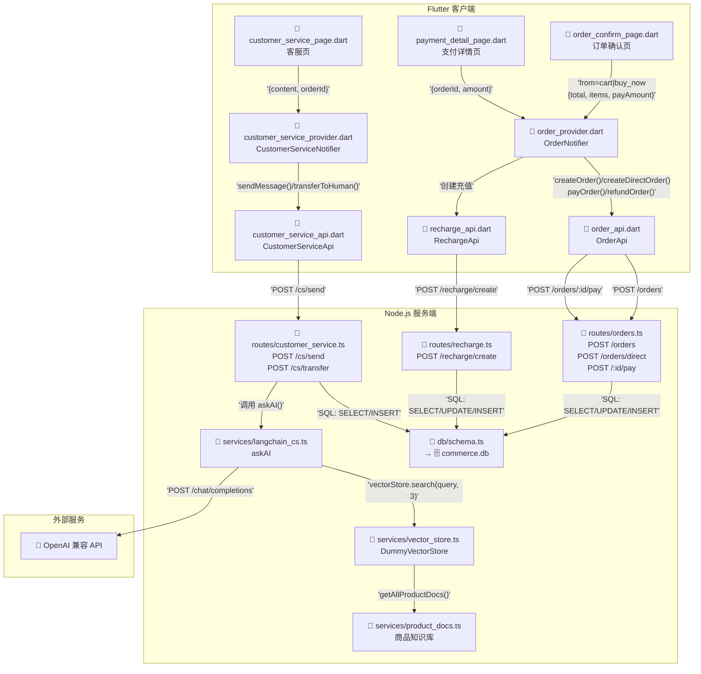
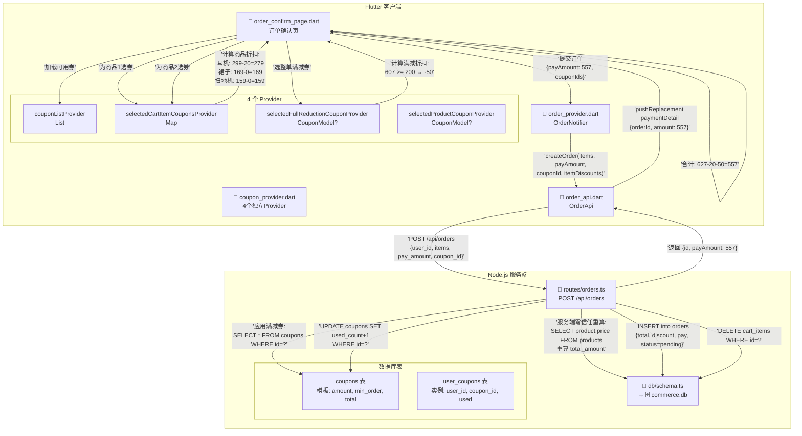

# 购物支付链路技术方案

## 1. 引言

### 1.1 项目背景

本项目是面向移动客户端的电商直播/短视频带货 App，核心闭环：

> **浏览内容流 → 看商品讲解 → 点击商品卡 → 领券加购 → 提交订单 → 支付 → 确认收货**

我负责**购物支付全链路**，涵盖移动端（Flutter）和服务端（Node.js）两端。

### 1.2 三大核心亮点

| 亮点 | 一句话总结 | 为什么与别人不同 |
|------|-----------|----------------|
| **抖币支付 + 梯度充值** | 参考游戏充值策略设计虚拟货币体系 | 不是简单对接微信/支付宝，而是构建平台自有货币生态——充值有赠送、支付有闭环，让钱"留"在平台 |
| **RAG 智能客服** | LLM 只能回答基于商品知识库的真实信息 | 不是简单地接个 ChatGPT API，而是用检索增强生成（RAG）给 LLM 加了一本"教科书"，杜绝 AI 幻觉 |
| **双层优惠券叠加** | 商品券 + 满减券独立计算、顺序叠加 | 不是简单的"满 100 减 10"，而是每件商品可独立用券 + 整单再用满减券，计算链清晰可扩展 |

### 1.3 目录

| 章节 | 一句话总结 |
|------|-----------|
| **第 2 章·架构总览** | 一张架构图看清分三层（Page→Provider→Route→DB），技术栈各有选择理由 |
| **第 3 章·抖币支付** | 参考游戏充值做梯度赠送，先扣后退消除并发窗口，`from` 参数让充值闭环不丢上下文 |
| **第 4 章·RAG 客服** | 检索商品文档再问 LLM，VectorStore 抽象接口，LLM 调用失败不崩页面只说"转人工" |
| **第 5 章·优惠券** | 先商品券后满减券保证用户利益最大化，4 个 Provider 互不干扰，模板实例分离为扩展留空间 |
| **第 6 章·重难点** | 下单链路数据窜源的根因分析与"身份识别+数据源隔离"的完整修复方案 |
| **第 7 章·边界容错** | 金额零信任、180 秒倒计时心理学依据、退款比例折算公式、AI 降级兜底——上线前必须考虑的四个边界 |
| **第 8 章·后续规划** | 支付接真实 SDK、客服换向量数据库、优惠券加规则引擎、订单加物流追踪——四件事的优先级 |

---

## 2. 架构总览

### 2.1 分层架构

```
Mobile (Flutter)
  Page Layer        Provider Layer      API Layer (Dio)
  ┌──────────┐      ┌───────────┐       ┌────────┐
  │ CartPage  │─────▶│CartProvider│─────▶│CartApi  │
  │ OrderConf │─────▶│OrderNotif. │─────▶│OrderApi │
  │ PayDetail │      │UserNotifier│      │RchgApi  │
  │ CustService│     └───────────┘       └───┬────┘
  └──────────┘                              │ HTTP
───────────────────────────────────────────┼───────
Server (Node.js + Fastify)                  │
  Routes Layer          Database Layer      │
  ┌──────────────┐     ┌──────────────┐     │
  │ orders.ts     │────▶│              │◀────┘
  │ recharge.ts   │────▶│  SQLite      │
  │ customer_svc  │────▶│ commerce.db  │
  │ cart.ts       │────▶│              │
  └──────────────┘     └──────────────┘
```

### 2.2 技术栈

| 层级 | 技术 | 选型理由 |
|------|------|---------|
| 移动端 | Flutter + Dart | 单代码库覆盖双端，热重载支撑快速迭代 |
| 状态管理 | Riverpod | `ref.watch` 依赖追踪精准刷 UI，Provider 组合优于继承 |
| 路由 | go_router | 路径参数天然匹配支付链路跨页面传参 |
| 网络层 | Dio | 拦截器统一处理 token 和异常，支付请求可靠性高 |
| 服务端 | Fastify (Node.js) | 插件化 + JSON Schema 内置校验，性能比 Express 高 2-3 倍 |
| 数据库 | better-sqlite3 | 同步 API 让支付事务代码简洁无竞态，零配置部署 |
| 实时通信 | Socket.IO | 房间机制精准推送，自动重连保活 |
| 智能客服 | RAG + OpenAI 兼容 API | 检索增强杜绝幻觉，切换模型改一行环境变量 |

### 2.3 核心数据模型

**orders 表**（关键字段）：

| 字段 | 类型 | 说明 |
|------|------|------|
| id | TEXT PK | UUID |
| user_id | TEXT FK | 用户 ID |
| total_amount | REAL | 商品总额 |
| discount_amount | REAL | 优惠金额 |
| pay_amount | REAL | 实付金额（不信任前端传入，后端重算） |
| status | TEXT | pending → paid → completed |
| items | TEXT(JSON) | **商品快照**——下单时固化，不随商品变更而变 |

**coupons / user_coupons 表**（模板-实例分离）：

- `coupons`：券模板（面额、门槛、总量、有效期）
- `user_coupons`：用户持有的券实例（是否已使用）

---

### 2.4 文件流转全景图与链路说明

**文件流转图说明**：下图以实际代码文件为粒度，展示了用户操作从 Flutter 页面层出发，经过 Provider 状态管理层、API 网络请求层，到达 Node.js 服务端，最终落库或调用外部 AI 的完整数据流转路径。每个箭头上的标注即为跨文件传递的核心参数。



**链路说明**：
- **蓝色区域 (Flutter 客户端)**：采用 Riverpod 三层架构——Page 层通过 `ref.watch/ref.read` 与 Provider 层通信；Provider 层通过构造函数注入 Api 实例；Api 层通过 Dio 发送 HTTP 请求。
- **绿色区域 (Node.js 服务端)**：路由层接收请求后，同步执行 SQL（`better-sqlite3` 确保支付事务无竞态）；AI 客服场景走 RAG 检索链路（vector_store → product_docs → langchain_cs → LLM）。
- **紫色区域 (外部服务)**：LLM API 采用 OpenAI 兼容格式，`LLM_API_URL` 加 `/chat/completions` 即可适配不同模型。

**文件映射关系验证**（与代码一一对应）：
| Flutter 页面 | Provider | API | 服务端路由 |
|---|---|---|---|
| `order_confirm_page.dart` | `order_provider.dart` | `order_api.dart::createOrder()/createDirectOrder()` | `orders.ts::POST /api/orders` |
| `payment_detail_page.dart` | `order_provider.dart` | `order_api.dart::payOrder()` | `orders.ts::POST /api/orders/:id/pay` |
| `customer_service_page.dart` | `customer_service_provider.dart` | `customer_service_api.dart::sendMessage()` | `customer_service.ts::POST /api/cs/send` |

## 3. 亮点一：抖币支付 + 梯度充值体系

### 3.1 为什么设计抖币 + 梯度充值？

如果只是对接微信/支付宝，那就跟所有电商 App 一样。我们参考了游戏行业经过几十亿用户验证的策略：

- **锚定效应**：用户看到 ¥648 送 ¥65（10%），再看 ¥198 只送 ¥15（7.6%），大脑自动得出"大额更划算"
- **数据佐证**：《2024/2025 中国游戏产业报告》及 CNG 数据显示，梯度定价使付费转化率提升 **2.1~4.7 倍**，大额档客单价提升 **180%+**
- **平台收益**：抖币是虚拟货币，赠送成本为零边际成本，换来的却是用户预存真金白银

### 3.2 充值赠送算法

```
充值套餐映射（预置套餐优先匹配）：
  PACKAGE_BONUS = { 6→0, 30→1, 98→5, 198→15, 328→28, 648→65 }

getBonus(amount):
  if amount in PACKAGE_BONUS:
    return PACKAGE_BONUS[amount]          // 预置套餐固定赠送
  else:
    return floor(amount × 0.05 × 100) / 100   // 自定义金额：5%，向下取整
```

> **为什么自定义金额只有 5%？** 预置套餐是平台引导消费的"锚点"。如果自定义赠送比例高于套餐，就没有人买套餐了。5% 既给甜头又不破坏体系。

### 3.3 支付原子性：先扣后退

抖币支付的核心风险是**并发**：两笔订单同时看到余额够用，但加起来不够。

我们的方案——**先扣后退**：

```
payOrder(orderId, paymentMethod='coin'):
  if paymentMethod == 'coin':
    user = SELECT coin_balance FROM users WHERE id = order.user_id
    if user.coin_balance < order.pay_amount:
      return 422 { balance, need }           // 余额不足，引导充值

    // ① 先扣（UPDATE 本身是线程安全的原子操作）
    UPDATE users SET coin_balance = coin_balance - pay_amount

  // ② 执行支付（模拟 90% 成功率）
  success = random() > 0.1

  if success:
    UPDATE orders SET status = 'paid'
  else:
    UPDATE orders SET status = 'payment_failed'
    // ③ 失败则退还
    if paymentMethod == 'coin':
      UPDATE users SET coin_balance = coin_balance + pay_amount

  return { status, new_balance }
```

> **为什么不用"成功后再扣"？** 查余额和扣余额之间有时间窗口，两笔订单可能同时读到同一笔余额。SQL 的 `UPDATE SET balance = balance - ?` 天然排队执行，先扣后退消除了这个并发窗口。

### 3.4 余额不足→充值→返回支付的闭环

**问题**：用户余额不足 → 去充值 → 充值完回到订单列表，支付上下文丢失，要重新找到订单再支付。

**根因**：充值模块不知道自己是从哪里被调用的（支付页？个人中心？），充值完成后不知道"之前有个订单等着付"。

**方案对比**：

| 方案 | 思路 | 缺点 |
|------|------|------|
| 方案A：全局状态 | 把"待支付订单"存全局变量 | 多订单场景混乱，状态不可靠 |
| 方案B：上下文透传 ✅ | 用 `from` 参数贯穿全流程 | 需要在每个页面解析参数 |

**选择方案B**，实现如下：

```
// 支付页 → 充值页：透传来源和订单信息
context.pushNamed('coinRecharge', queryParams: {
  'from': 'payment',                        // 来源标识
  'order_id': orderId,
  'amount': payAmount
})

// 充值成功 → 结果页：继续透传（用 pushReplacement 避免返回栈膨胀）
context.pushReplacementNamed('rechargeResult', queryParams: {
  'from': 'payment',
  'order_id': orderId
})

// 结果页 → 根据 from 参数决定按钮行为
if (from == 'payment'):
  显示「返回支付页面」→ pushReplacementNamed('paymentDetail', { orderId })
else:
  显示「返回个人中心」→ pop()
```

> **设计的本质**：`from` 参数是一个**多态行为开关**。充值模块不依赖支付模块，只是暴露一个参数让调用方决定行为。后续直播打赏、会员购买需要充值时，传入新 `from` 值即可，充值模块零改动——这就是**依赖倒置原则**。

---

### 3.5 抖币支付与充值文件流转图

**文件流转图说明**：支付场景涉及 3 个页面（支付详情页→充值页→充值结果页）之间的来回跳转，核心挑战是"余额不足→充值→返回支付"的上下文不丢失。本图展示 `from` 参数如何贯穿全链路，解决上下文传递问题。

```mermaid
flowchart TD
    subgraph flutter[Flutter 客户端]
        PDP[📄 payment_detail_page.dart<br/>支付详情页]
        CRP[📄 coin_recharge_page.dart<br/>充值页]
        RRP[📄 recharge_result_page.dart<br/>充值结果页]
        
        OP[📄 order_provider.dart<br/>OrderNotifier]
        RP[📄 recharge_api.dart<br/>RechargeApi]
        
        OA[📄 order_api.dart<br/>OrderApi]
        RA[📄 recharge_api.dart<br/>RechargeApi]
    end
    
    subgraph server[Node.js 服务端]
        OR[📄 routes/orders.ts<br/>POST /:id/pay]
        RR[📄 routes/recharge.ts<br/>POST /recharge/create<br/>GET /users/:id/coins]
        DB[📄 db/schema.ts<br/>→ 🗄️ commerce.db]
    end

    PDP -- '1. 选择"抖币支付"' --> OP
    PDP -- '2. 检查余额: coinBalance < amount' --> PDP
    PDP -- '3. 弹框→跳转充值<br/>from=payment, orderId, amount' --> CRP
    
    CRP -- '4. POST /recharge/create<br/>{userId, amount, paymentMethod}' --> RA
    RA -- '5. POST /recharge/create' --> RR
    
    RR -- '6. getBonus(amount) 计算赠送<br/>固定套餐/5%' --> RR
    RR -- '7. INSERT recharge_records<br/>UPDATE users.coin_balance' --> DB
    RR -- '8. 返回 {total_coins, new_balance}' --> CRP
    
    CRP -- '9. 跳转充值结果<br/>from=payment, orderId' --> RRP
    
    RRP -- '10. from==payment?<br/>→ pushReplacement paymentDetail<br/>→ pop()' --> PDP
    
    PDP -- '11. 余额充足→调 payOrder' --> OP
    OP -- '12. payOrder(orderId, coin)' --> OA
    OA -- '13. POST /orders/:id/pay<br/>{payment_method: coin}' --> OR
    
    OR -- '14. UPDATE coin_balance -= payAmount<br/>UPDATE orders status=paid' --> DB
    OR -- '15. 成功→paymentResult<br/>失败→退还coin_balance' --> OR
```

**关键链路说明**：
1. **余额检查**：`payment_detail_page.dart` 的 `_doPay()` 方法先读 `ref.read(userProvider).coinBalance`，若不足则调 `_showInsufficientBalanceDialog()` 弹框引导充值。
2. **充值上下文传递**：充值按钮的 `context.pushNamed('coinRecharge', queryParams: {from: 'payment', order_id, amount})`——`from` 参数标识"我从支付页来"，这是解决"充完值回哪里"的核心设计。
3. **充值赠送算法**：`recharge.ts` 的 `PACKAGE_BONUS` 映射表（6→0, 30→1, 98→5, 198→15, 328→28, 648→65），非套餐金额按 5% 向下取整。`getBonus(amount)` 函数同时被前端 `coin_recharge_page.dart` 用于预览展示。
4. **充值结果页路由**：`RRP` 根据 `from` 参数决定按钮行为——`from==payment` 则 `pushReplacementNamed('paymentDetail', {orderId})` 回支付页，否则 `pop()` 回个人中心。这就是文档说的"依赖倒置原则"。
5. **先扣后退原子性**：`orders.ts::POST /:id/pay` 中 `payment_method==coin` 时，先 `UPDATE coin_balance -= payAmount`，若模拟支付失败再 `UPDATE coin_balance += payAmount`。同步 SQL 天然排队，消除并发窗口。

**代码验证**：
- 方法名 `payOrder()` 在 `order_provider.dart:90` 和 `order_api.dart:67` 完全一致
- 充值赠送常量 `PACKAGE_BONUS` 在 `recharge.ts:8` 定义
- `from` 参数使用在 `payment_detail_page.dart:190` 可见

## 4. 亮点二：RAG 智能客服

### 4.1 为什么不直接接 LLM，而是用 RAG？

直接让 GPT 回答用户"这个耳机支持什么蓝牙版本"，它可能编一个"蓝牙 6.0"——实际上只有 5.3。这在电商客服是**不可触碰的红线**。

RAG（检索增强生成）的思路是：**先检索知识库，再让 LLM 基于检索结果回答**，相当于给 LLM 加了一本"教科书"。

```
用户提问 "这款耳机的降噪深度是多少？"
    │
    ▼
VectorStore.search(query, topK=3)
    │  检索到：TWS降噪蓝牙耳机 Pro 文档
    ▼
构建 System Prompt（注入知识库上下文）
    │
    ▼
callLLM([system, ...history, user])
    │
    ▼
"这款耳机的 ANC 主动降噪深度为 -35dB，能有效隔绝环境噪音 🤗"
```

### 4.2 检索链路伪代码

```
async function askAI(userMessage, history):
  // 1. 检索相关商品文档（Top 3）
  relevantDocs = await vectorStore.search(userMessage, 3)

  // 2. 拼接文档内容注入 System Prompt
  docsContext = relevantDocs.map(doc => `【${doc.name}】\n${doc.content}`).join('\n---\n')
  systemPrompt = buildSystemPrompt(docsContext)   // 含"只基于知识库回答，找不到就说转人工"

  // 3. 构建消息列表
  messages = [{ role: 'system', content: systemPrompt }]
  messages.push(...history.slice(-6))            // 保留最近 6 条历史
  messages.push({ role: 'user', content: userMessage })

  // 4. 调用 LLM（OpenAI 兼容 API）
  reply = await fetch(LLM_API_URL + '/chat/completions', {
    headers: { 'Authorization': `Bearer ${LLM_API_KEY}` },
    body: JSON.stringify({ model: LLM_MODEL, messages, max_tokens: 500 })
  })

  return reply

// 失败降级
catch:
  return '抱歉，请稍后再试或点击"转人工"联系人工客服 🙏'
```

### 4.3 VectorStore 接口抽象——为未来设计

当前 Demo 只有 1 个商品文档，直接全量返回。但文档量增长到 200 个时，必须做向量检索。于是定义了接口：

```
interface IVectorStore {
  search(query: string, topK?: number): Promise<ProductDoc[]>
  rebuild(docs: ProductDoc[]): Promise<void>
}

// 当前实现：DummyVectorStore（全量返回）
// 未来切换：只需写一个 ChromaVectorStore 或 PineconeVectorStore 实现类
// 业务代码一行不改：vectorStore.search(query, 3)
```

> 这是**策略模式**的经典应用：面向接口编程，而非面向实现。当前够用，未来可扩展。

### 4.4 降级与转人工

- **LLM 调用失败**：不抛异常，返回兜底文案 + 引导转人工。用户感受到的是"有人理我"，而不是 "500 Error"
- **知识库查不到**：System Prompt 写死"找不到就说转人工"，不编造答案
- **转人工后**：前端标记 `isHumanService = true`，AI 闭嘴，人工接管——避免"AI 和人工抢答"

---

### 4.5 RAG 智能客服文件流转图

**文件流转图说明**：智能客服的核心是"检索增强生成"——先搜索商品文档，再让 LLM 基于文档内容回答。本图展示从用户发消息→服务端搜索→AI 回复→存数据库的完整文件调用链。

```mermaid
flowchart TD
    subgraph flutter[Flutter 客户端]
        CSP[📄 customer_service_page.dart<br/>客服页]
        CSN[📄 customer_service_provider.dart<br/>CustomerServiceNotifier]
        CSA[📄 customer_service_api.dart<br/>sendMessage()]
    end
    
    subgraph server[Node.js 服务端]
        CSR[📄 routes/customer_service.ts<br/>POST /send<br/>POST /transfer]
        LC[📄 services/langchain_cs.ts<br/>askAI(userMsg, history)]
        VS[📄 services/vector_store.ts<br/>DummyVectorStore.search()]
        PD[📄 services/product_docs.ts<br/>getAllProductDocs()]
        DB[📄 db/schema.ts<br/>→ 🗄️ commerce.db]
    end
    
    subgraph external[外部]
        LLM[🤖 OpenAI 兼容 API<br/>POST /chat/completions]
    end

    CSP -- '用户输入消息<br/>"这个耳机降噪多少?"' --> CSN
    CSN -- 'sendMessage(orderId, userId, content)' --> CSA
    CSA -- 'POST /cs/send' --> CSR
    
    CSR -- '① 保存用户消息到DB' --> DB
    CSR -- '② 调用 askAI()' --> LC
    
    LC -- '③ vectorStore.search(query, 3)' --> VS
    VS -- '④ getAllProductDocs()<br/>返回全部/Top3文档' --> PD
    PD -- '⑤ 返回文档内容<br/>如: "TWS降噪耳机Pro"' --> LC
    
    LC -- '⑥ 构建System Prompt<br/>注入文档作为上下文' --> LC
    LC -- '⑦ 构建消息列表<br/>system + history(6条) + user' --> LC
    LC -- '⑧ POST /chat/completions' --> LLM
    
    LLM -- '⑨ 返回AI回答<br/>例如: "ANC深度-35dB"' --> LC
    
    LC -- '⑩ 返回reply字符串' --> CSR
    CSR -- '⑪ 保存AI回复到DB' --> DB
    CSR -- '⑫ 返回 {messages: [userMsg, aiMsg]}' --> CSA
    
    CSA -- '⑬ 更新messages列表' --> CSN
    CSN -- '⑭ 通知UI更新' --> CSP
    
    CSP -- '⑮ 用户点击"转人工"' --> CSN
    CSN -- 'transferToHuman()' --> CSA
    CSA -- 'POST /cs/transfer' --> CSR
    CSR -- '⑯ INSERT system+admin消息<br/>标记 isHumanService=true' --> DB
```

**关键链路说明**：
1. **消息流程**：`customer_service_page.dart` 输入消息 → `customer_service_provider.dart` 的 `sendMessage()` → `customer_service_api.dart` 的 `sendMessage('POST /cs/send')`。
2. **RAG 三步走**：`langchain_cs.ts::askAI()` 内——
   - ① `vectorStore.search(query, 3)` 检索商品文档（当前为 `DummyVectorStore`，全量返回）
   - ② 构建 `system prompt`，把文档内容注入为"知识库上下文"
   - ③ `callLLM(messages)` 调 OpenAI 兼容 API，`max_tokens=500` 控制回复长度
3. **降级兜底**：若 `callLLM()` 抛出异常（网络超时、API 无响应），`catch` 块直接返回"转人工"文桸，不抛错给前端。用户看到的是"请稍后再试或转人工"而不是 500 白屏。
4. **转人工机制**：`transferToHuman()` 后 `customerServiceState.isHumanService = true`，前端不再发 AI 请求，只调 `reply()` 让管理员回消息。
5. **VectorStore 接口抽象**：`IVectorStore` 定义了 `search()` 和 `rebuild()` 方法，当前 `DummyVectorStore` 全量返回，未来切换到 `ChromaVectorStore` 只需新增一个实现类，业务代码 `langchain_cs.ts` 一行不改。

**代码验证**：
- 路由层 `customer_service.ts` 的 `POST /send` 内部调用 `askAI()` 于 `langchain_cs.ts:206`
- `askAI()` 的 `vectorStore.search()` 于 `langchain_cs.ts:210`
- `callLLM()` 的 `fetch()` 调用于 `langchain_cs.ts:157`
- 系统提示词 `buildSystemPrompt()` 中写死了"找不到就说转人工"于 `langchain_cs.ts:65`

## 5. 亮点三：双层优惠券叠加架构

### 5.1 计算链设计

```
商品总额 ¥627
   │
   ├── 商品券（每件商品独立选择1张）
   │   耳机 ¥299 - ¥20 = ¥279
   │   裙子 ¥169 - ¥0  = ¥169
   │   扫地机 ¥159 - ¥0  = ¥159
   │   券后小计 = ¥607
   │
   ├── 满减券（整单选择1张）
   │   ¥607 ≥ ¥200 门槛 → -¥50
   │
   ▼
实付 ¥557
```

> **为什么先商品券后满减券？** 这保证了用户利益最大化——如果先满减后商品券，满减拿了 ¥50 优惠，单品的 ¥20 券可能因为门槛变化用不上。我们的顺序让"只要有券、满足条件，就一定能用上"。

### 5.2 为什么用 4 个 Provider 而非 1 个？

优惠券的选择状态有三个完全不同的作用域：

| Provider | 作用域 | 数据结构 | 生命周期 |
|----------|--------|---------|---------|
| `couponListProvider` | 用户全部可用券 | `List<CouponModel>` | 全局持久化 |
| `selectedCartItemCouponsProvider` | 每个商品选的商品券 | `Map<cartItemId, CouponModel?>` | 购物车页面级 |
| `selectedFullReductionCouponProvider` | 整单选的满减券 | `CouponModel?` | 购物车页面级 |
| `selectedProductCouponProvider` | 商品详情页选的券 | `CouponModel?` | 详情页页面级 |

全塞进一个 Provider 会导致：① 任何字段变化触发所有消费者重建；② 改商品券不小心影响满减券。拆分后每个 Provider 只做一件事——**小 Provider 组合优于大 Provider 继承**。

### 5.3 模板-实例分离的表设计

```
coupons（券模板）          user_coupons（用户持有实例）
┌──────────────────┐      ┌──────────────────────┐
│ id, title, amount│      │ id, user_id, coupon_id│
│ min_order, total │      │ used (0/1)           │
│ used_count       │      └──────────────────────┘
└──────────────────┘
```

> **为什么分两张表？** ① 总量控制（`total_count`）在模板表上，避免每次都 join 计数；② 用户持有的券可以独立管理（过期、删除），不影响模板；③ 未来加"每人限领 N 张"只需在 `user_coupons` 上加约束。

---

### 5.4 双层优惠券叠加文件流转图

**文件流转图说明**：优惠券计算涉及"先商品券后满减券"的严格顺序，且 4 个 Provider 各自独立。本图展示从用户选券→前端计算→提交订单→服务端重算的完整链路。



**关键链路说明**：
1. **选券 UI**：`order_confirm_page.dart` 读取 4 个独立的 Provider——
   - `couponListProvider`：用户全部可用券（全局持久化）
   - `selectedCartItemCouponsProvider`：购物车每件商品的商品券（页面级）
   - `selectedFullReductionCouponProvider`：整单满减券（页面级）
   - `selectedProductCouponProvider`：商品详情页选的券（详情页级）
2. **计算链**：商品总价 ¥627 → 商品券折扣（耳机 -20）→ 券后小计 ¥607 → 满减券折扣（200-50）→ 实付 ¥557。顺序固定——先商品券后满减券保证用户利益最大化。
3. **提交订单**：`createOrder()` 携带 `payAmount: 557` 和逐项 `itemDiscounts: {耳机: 20}` 到服务端。
4. **服务端零信任**：`orders.ts::POST /api/orders` 中，服务端从数据库查 `products.price` 重算 `totalAmount`，即使用户伪造 `payAmount=1` 也会被纠正。前端传的 `pay_amount` 仅作为"参考值"，服务端计算 `discountAmount = totalAmount - payAmount`。
5. **模板-实例分离**：`coupons` 表存面额/门槛/总量等模板信息，`user_coupons` 表存用户和券的关联（`used` 标记），扩展"每人限领 N 张"只需在 `user_coupons` 加 UNIQUE 约束。

**代码验证**：
- 服务端重算逻辑在 `orders.ts:86-108`：`SELECT id, name, cover_url, price, stock FROM products WHERE id = ?`
- 优惠券应用逻辑在 `orders.ts:110-120`：`SELECT * FROM coupons WHERE id = ? AND status = ?`
- 前端 `_getDisplayItems()` 方法在 `order_confirm_page.dart:76-90`——区分 `from=cart`（读购物车）和 `from=buy_now`（用路由参数构建单商品）

## 6. 重难点：下单链路的数据窜源问题

### 6.1 问题场景

用户有两种方式进入下单流程：

- **方式A（购物车结算）**：购物车勾选商品 → 点击结算 → 订单确认页
- **方式B（立即购买）**：视频/直播页看中商品 → 点击"立即购买" → 订单确认页

两个入口汇聚到同一个页面——订单确认页。

### 6.2 问题现象

用户从**方式B（立即购买）**进入时，订单确认页**显示了购物车里的商品**，而不是当前正在看的商品。用户感知："这个 App 的购买按钮是坏的"。

### 6.3 根因分析

**直接原因**：路由跳转时丢了两个关键信息——① 数据来源标记（从哪来的）；② 商品快照（买的是什么）。

**本质原因——架构补位问题**：订单确认页最初只服务"购物车结算"，数据读取硬编码为从购物车 Provider 获取。新增"立即购买"时只加了跳转按钮，没区分数据源。这在软件工程中属于典型的**功能耦合**——UI 复用了同一个页面，但业务语义完全不同。

### 6.4 方案决策

| | 方案A：合并 | 方案B：分离 ✅ |
|---|---|---|
| **思路** | 后端一个接口，前端用参数区分 | 前端分数据分支，后端独立接口 |
| **优点** | 改动小 | 两条链路独立演进，互不牵制 |
| **缺点** | 多商品/单商品强行捆绑，扩展困难 | 需新增接口和逻辑分支 |

**选择方案B**。核心考量：购物车结算（多商品、优惠分摊、清空购物车）和立即购买（单商品快照、不碰购物车）是两种完全不同的交易场景。在架构上**提前分离**，比业务复杂后再重构成本低得多。

### 6.5 实现：身份识别 + 数据源隔离

```
// 方式A：购物车结算 → 订单确认页
//   from='cart' → 从购物车 Provider 读取数据 → POST /api/orders

// 方式B：立即购买 → 订单确认页
//   from='direct', productId, price, cover 等全部透传
//   → 从路由参数读取数据 → POST /api/orders/direct（独立接口，不碰购物车）

// 后端 direct 接口
POST /api/orders/direct { user_id, product_id, quantity, spec, address }
  → 校验商品状态和库存
  → 创建订单（不关联购物车）
  → 返回订单信息
```

最终效果：两条链路彻底解耦，各走各的道。

---

## 7. 边界与容错

### 7.1 金额零信任

前端传的 `total_amount` 不可信——任何人都能抓包改请求体把 ¥1000 改成 ¥1。**后端必须重算**：从数据库查商品真实价格 × 数量，重新计算 `total_amount`、`discount_amount`、`pay_amount`。

### 7.2 支付倒计时的心理学依据

支付页 180 秒倒计时，最后 30 秒变红。行业研究表明：太短（60 秒）压迫感强导致放弃，太长（10 分钟）失去紧迫感。180 秒是平衡点，变红制造**损失厌恶**——"再不付就没了"。

### 7.3 退款金额按比例折算

订单用了满减券（满 200 减 50，3 件实付 ¥150），退其中 1 件（原价 ¥100）：

```
refundAmount = (商品小计 × quantity) × (payAmount / totalAmount)
            = 100 × (150/200) = 75 元
```

退 ¥75 而非 ¥100，因为用户只付了这件商品的折后价。按比例折算保证公平。

### 7.4 AI 降级兜底

LLM 调用失败时，不抛异常，返回：
> "抱歉，请稍后再试或点击"转人工"联系人工客服 🙏"

用户不关心"背后是 AI 还是人"，他们只需要知道问题能否被解决。兜底文案 + 明显的转人工入口 > "500 Error"。

---

## 8. 后续规划

| 方向 | 当前状态 | 下一步 |
|------|---------|--------|
| **支付** | 模拟支付（90% 随机成功率） | 接入微信/支付宝真实 SDK，引入 `payment_id` 幂等，服务端定时取消超时订单 |
| **客服** | DummyVectorStore（全量返回） | 替换 ChromaDB/Pinecone 做真实 Embedding 检索；从数据库自动构建商品知识库 |
| **优惠券** | 两种类型固定叠加 | 折扣券、运费券等新类型；规则引擎支持"互斥/叠加/优先"策略 |
| **订单** | 基础 CRUD + 商品级退款 | 物流追踪、订单评价、拼团/秒杀 |